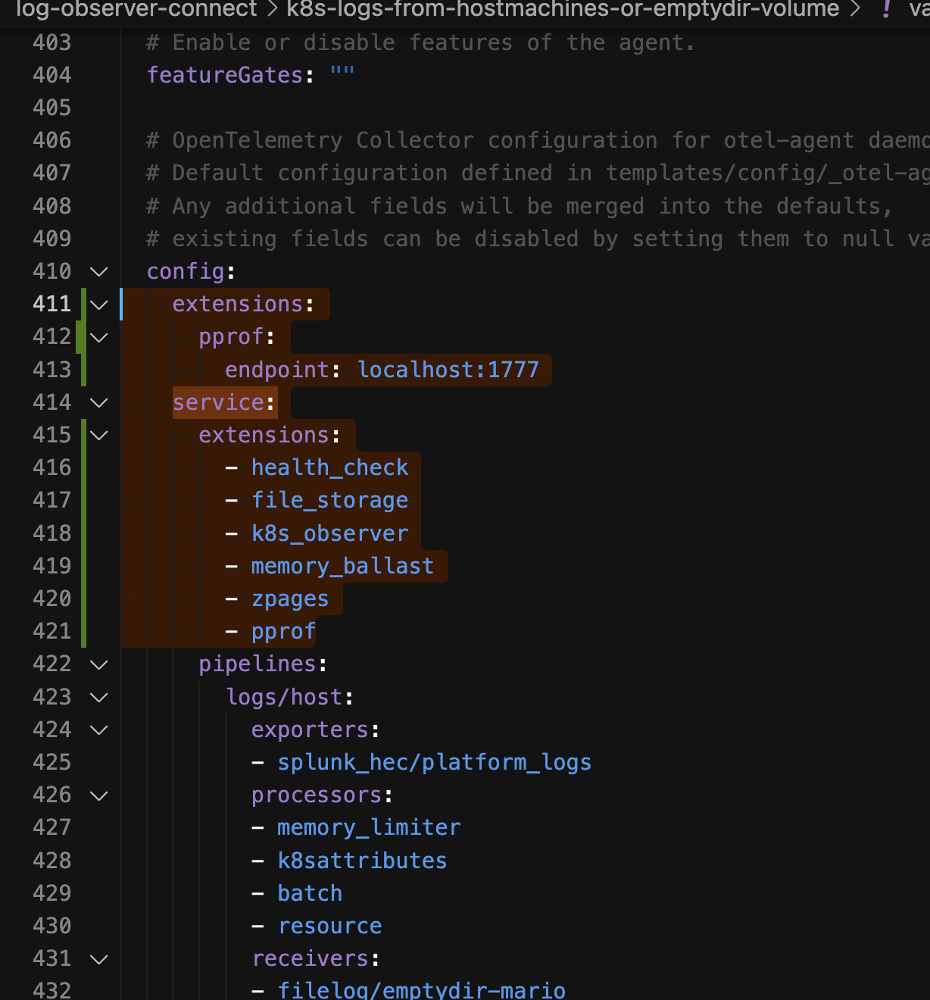
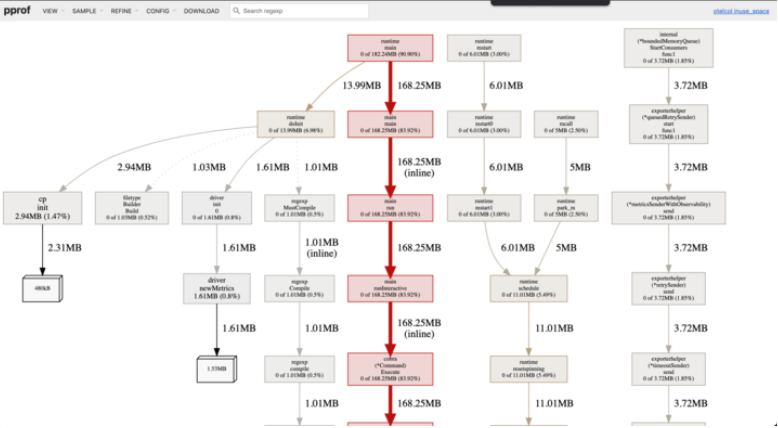

# Guide courtesy: Learning from Matthew Modestino TKO guide.

- Add this to the values.yaml file 
- If Splunk OTel Collector Chart is installed in namespace otel
    - Collect heaps a couple times a minute with `kubectl -n otel exec splunk-otel-collector-agent-<something something> -- curl -s http://127.0.0.1:1777/debug/pprof/heap > heap.out`
    - Collect go routines with kubectl -n otel exec splunk-otel-collector-agent-<something something> -- curl -s http://127.0.0.1:1777/debug/pprof/goroutine?debug=2 > routine.out
    - Visualise it with graphviz https://www.graphviz.org/download/
    - 
