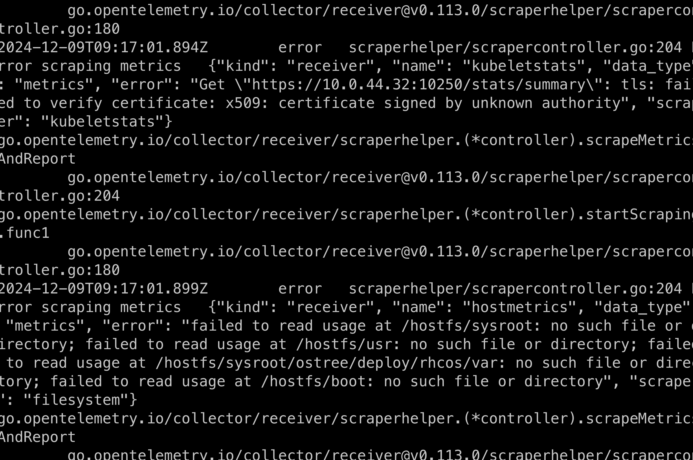
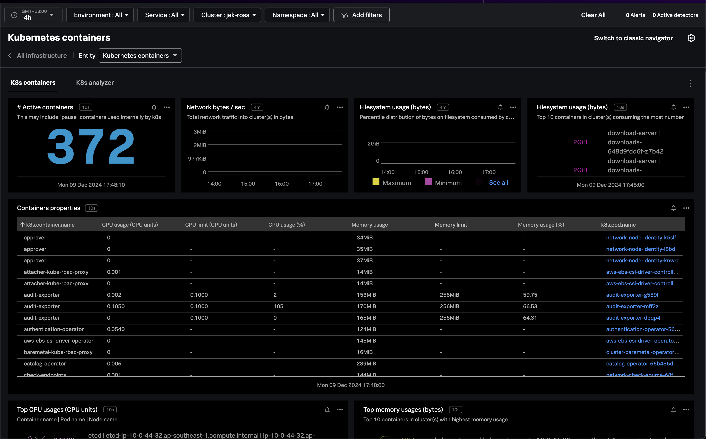

1. Ensure that Red Hat OpenShift Service on AWS (ROSA) is enabled through AWS console

2. Sign in to https://www.redhat.com

3. Follow the instructions such as

4. Install ROSA cli
`brew install rosa-cli`

5. Manage ROSA credential and privileges
`rosa login`
```bash
rosa login

# or login directly with token
#The token is from Red Hat account after signing in to redhat.com
rosa login --token="<redacted>"

rosa whoami

rosa verify quota
```

6. Use ROSA for creating Openshift cluster
https://www.rosaworkshop.io/rosa/2-deploy/#automatic-mode
```bash
# Create account roles
rosa create account-roles --mode auto --yes

# Create cluster with a cluster name no more than 15 characters
rosa create cluster --interactive --sts

# Follow instructions to complete installation with 
rosa create operator-roles --cluster <cluster name>
rosa create oidc-provider --cluster <cluster name>

# See all available clusters
rosa list clusters

# Describe cluster
rosa describe cluster --cluster <cluster-name>

# Wait for console URL and get the console URL
rosa describe cluster -c <cluster-name> | grep Console
```
Note: It takes about 30 to 40 minutes to create cluster as stated here https://docs.openshift.com/rosa/rosa_getting_started/rosa-quickstart.html 

7. Install Openshift CLI
`brew install openshift-cli`

8. Path 1 Create quick login using admin
https://www.rosaworkshop.io/rosa/3-create_initial_admin/
`rosa create admin --cluster=<cluster name>`

  Please save the password somewhere!

8. or Path 2 Setup an IDP, Granting Admin Right, and Accessing the cluster
https://www.rosaworkshop.io/rosa/4-setup_idp/
https://www.rosaworkshop.io/rosa/5-grant_admin/
https://www.rosaworkshop.io/rosa/6-access_cluster/
Note: This setup is more cumbersome but more secure so it is recommended

9. Login using Openshift CLI (OC)
```bash
# Get API URL
rosa describe cluster -c <cluster name> | grep API

# Login using OC
oc login <API URL> --username cluster-admin --password <redacted>

# Verify login successful
oc whoami
```

10. Check that in default namespace
```bash
# See all projects
oc projects

# See in kubectl
kubectl get namespace
```

# Install OTel Collector in K8s

```
helm repo add splunk-otel-collector-chart https://signalfx.github.io/splunk-otel-collector-chart
```

```
helm repo update
```

- At the time of installation this is the version `splunk-otel-collector-0.113.0`.

- Change realm and access in `values-one.yaml` and install splunk-otel-collector in ROSA using the values-one.yaml

```
helm install splunk-otel-collector splunk-otel-collector-chart/splunk-otel-collector --version 0.113.0 --values values-one.yaml

# OR if we don't want to use imperative approach, we can use declarative approach.

helm install splunk-otel-collector --set="cloudProvider=aws,distribution=openshift,splunkObservability.accessToken=<REDACTED_ACCESS_TOKEN>,clusterName=jek-rosa,splunkObservability.realm=us1,gateway.enabled=false,splunkObservability.profilingEnabled=true,environment=jek-sandbox" splunk-otel-collector-chart/splunk-otel-collector --version 0.113.0
```
Note: At the time of writing, the latest version of splunk-otel-collector-chart is 0.113.0 so I specifically add 0.113.0 as the version

Right after installation, if you encounter the following error after running e.g. `kubectl logs pod/<THE_OTEL_COLLECTOR_AGENT_POD_NAME>`:

```
2024-12-09T09:17:01.894Z	error	scraperhelper/scrapercontroller.go:204	Error scraping metrics	{"kind": "receiver", "name": "kubeletstats", "data_type": "metrics", "error": "Get \"https://10.0.44.32:10250/stats/summary\": tls: failed to verify certificate: x509: certificate signed by unknown authority", "scraper": "kubeletstats"}
go.opentelemetry.io/collector/receiver/scraperhelper.(*controller).scrapeMetricsAndReport
	go.opentelemetry.io/collector/receiver@v0.113.0/scraperhelper/scrapercontroller.go:204
go.opentelemetry.io/collector/receiver/scraperhelper.(*controller).startScraping.func1
	go.opentelemetry.io/collector/receiver@v0.113.0/scraperhelper/scrapercontroller.go:180
2024-12-09T09:17:01.899Z	error	scraperhelper/scrapercontroller.go:204	Error scraping metrics	{"kind": "receiver", "name": "hostmetrics", "data_type": "metrics", "error": "failed to read usage at /hostfs/sysroot: no such file or directory; failed to read usage at /hostfs/usr: no such file or directory; failed to read usage at /hostfs/sysroot/ostree/deploy/rhcos/var: no such file or directory; failed to read usage at /hostfs/boot: no such file or directory", "scraper": "filesystem"}
go.opentelemetry.io/collector/receiver/scraperhelper.(*controller).scrapeMetricsAndReport
	go.opentelemetry.io/collector/receiver@v0.113.0/scraperhelper/scrapercontroller.go:204
go.opentelemetry.io/collector/receiver/scraperhelper.(*controller).startScraping.func1
	go.opentelemetry.io/collector/receiver@v0.113.0/scraperhelper/scrapercontroller.go:180
```


## Resolve the `tls: failed to verify certificate: x509`  and the `failed to read usage at /hostfs/sysroot: no such file or directory; failed to read usage at /hostfs`

### Step 1: Resolve `tls: failed to verify certificate: x509` by adding `insecure_skip_verify: true`

As shown here https://docs.splunk.com/observability/en/gdi/opentelemetry/collector-kubernetes/kubernetes-config-advanced.html#override-your-tls-configuration 
```
  config:
    receivers:
      kubeletstats:
        insecure_skip_verify: true
```

Refer to `values-two.yaml` for how it is done.

Note: To skip certificate checks, you can disable secure TLS checks per component. This option is not recommended for production environments due to security standards.

### Step 2: Revert to install the older version of splunk-otel-collector-chart

At the time of writing, the latest version of splunk-otel-collector-chart is 0.113.0 so I specifically add 0.113.0 as the version.

See here for a list of version https://github.com/signalfx/splunk-otel-collector-chart/releases. The stable version seemed to be `0.111.0`.

* remember to replace the realm and access token in the values-two.yaml

```
helm install splunk-otel-collector splunk-otel-collector-chart/splunk-otel-collector --version 0.111.0 --values values-two.yaml
```





# Clean up

11. Use ROSA to delete Openshift cluster
https://www.rosaworkshop.io/rosa/12-delete_cluster/
