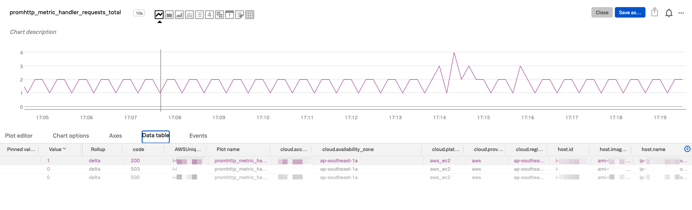
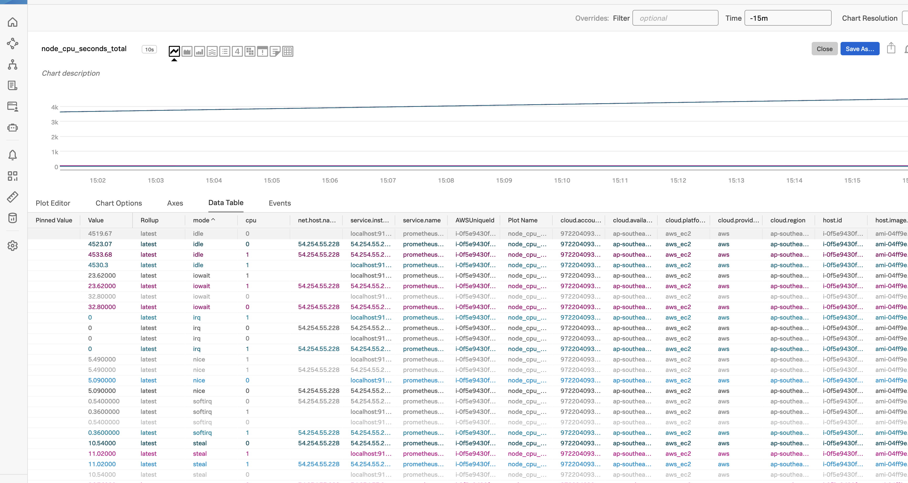
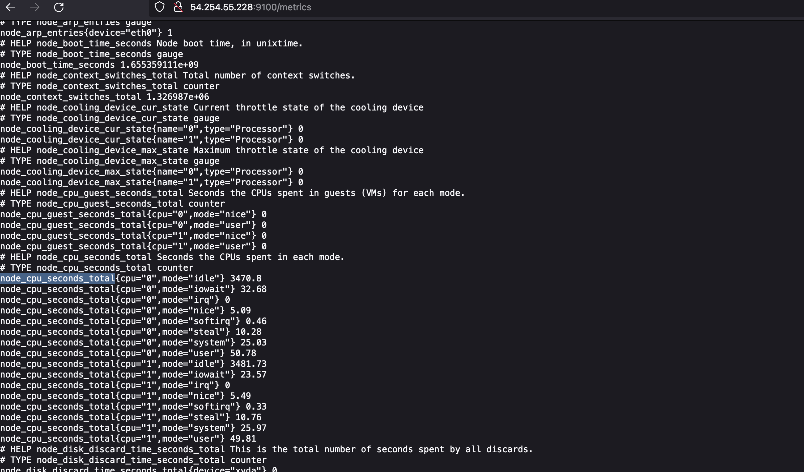
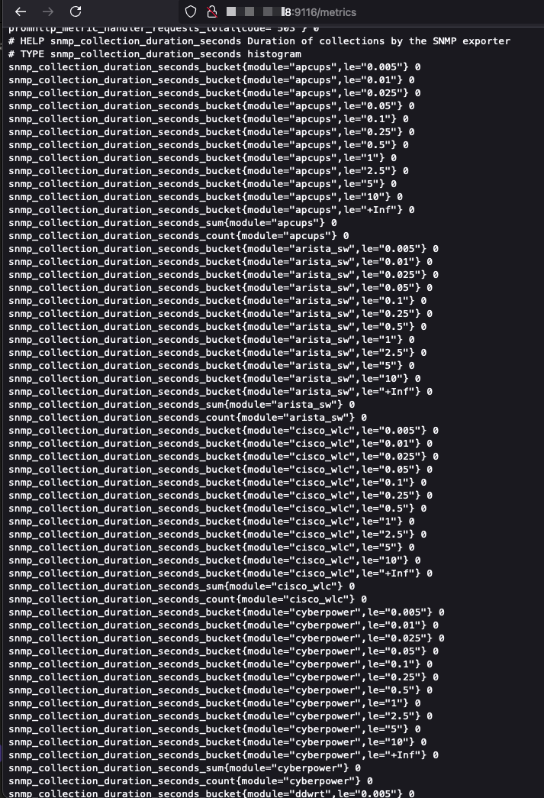

# **Setup Prometheus Server**

1. SSH into an Ubuntu instance with EC2
2. Go to root `sudo su`
3. Update and upgrade `apt-get update & apt-get upgrade` and `exit` when done.
4. Download Prometheus for Linux from https://prometheus.io/download/#prometheus e.g. `sudo wget https://github.com/prometheus/prometheus/releases/download/v2.53.3/prometheus-2.53.3.linux-amd64.tar.gz`
5. Extract the file `tar xvf prometheus-2.53.3.linux-amd64.tar.gz`
6. Go to the extracted folder `cd prometheus-2.53.3.linux-amd64/`
7. In the folder that has promtool run `./promtool check config prometheus.yml` to check the YAML file validity.
8. Start Prometheus `./prometheus`
9. Open a new terminal interface.
10. Get EC2 public ip address `curl http://checkip.amazonaws.com`
11. In web browser go to `http://<ip address>:9090`. Make sure Security Rule allows Custom TCP port 9090.
12.  Run the `up` command in Prometheus query.

# **Setup Node Exporter**

The Node exporter looks at /sys and /proc pseudo files systems

1. Back to SSH EC2 Ubuntu console. Download Node exporter for Linux from https://prometheus.io/download/#node_exporter e.g. `sudo wget https://github.com/prometheus/node_exporter/releases/download/v1.8.2/node_exporter-1.8.2.linux-amd64.tar.gz`
2. Extract Node exporter from compressed `tar xvf node_exporter-1.8.2.linux-amd64.tar.gz`
3. Go to the Node exporter folder after extraction ` cd node_exporter-1.8.2.linux-amd64/`
4. Start the Node exporter `./node_exporter`
5. Get EC2 public ip address `curl http://checkip.amazonaws.com`
6. In web browser go to `http://<ip address>:9100`. Make sure Security Rule allows Custom TCP port 9100.

# **Prometheus --(scrape from)--> Node Exporter**

1. Back to SSH EC2 Ubuntu. Go to the folder of `cd prometheus-2.53.3.linux-amd64/`
2. Create a copy of prometheus calling it `cp prometheus.yml custom-prometheus.yml`
3. Add new target for scraping `vim custom-prometheus.yml`
```yml
scrape_configs:
  - job_name: "prometheus"
    static_configs:
      - targets: ["localhost:9090"]
  - job_name: "node-exporter-on-ubuntu" # Newly added
    static_configs: # Newly added 
      - targets: ["localhost:9100"] # Newly added
```

4. Run Prometheus server by using the custom-prometheus.yml file e.g. `./prometheus --storage.tsdb.retention.time=13d --config.file="/home/ubuntu/prometheus-2.53.3.linux-amd64/custom-prometheus.yml"`
5. Run a query in Prometheus `node_cpu_seconds_total` and click Execute to show 

# **Setup OTel Collector**

1. Install splunk-otel-collector
```bash
curl -sSL https://dl.signalfx.com/splunk-otel-collector.sh > /tmp/splunk-otel-collector.sh && \
sudo sh /tmp/splunk-otel-collector.sh --realm us1 -- <ACCESS TOKEN REDACTED> --mode agent --without-instrumentation
```

# **Use OTel Collector --(scrape)--> Prom & Node Exporter Metrics

1. Edit this file `sudo vim /etc/otel/collector/agent_config.yaml` 

2. add `prometheus_simple/prom` and `prometheus_simple/node` (you can name this it something else other than node or prom too) like this url https://github.com/open-telemetry/opentelemetry-collector-contrib/tree/main/receiver/simpleprometheusreceiver with sample in the folder. 

```yml
receivers:
  prometheus_simple/prom:
    collection_interval: 10s
    endpoint: "127.0.0.1:9090"
    tls:
      insecure_skip_verify: true
  prometheus_simple/node:
    collection_interval: 10s
    endpoint: "127.0.0.1:9100"
    tls:
      insecure_skip_verify: true
```

```yml
    metrics:
      receivers: [hostmetrics, otlp, signalfx, prometheus_simple/prom, prometheus_simple/node]
```


4. Restart `sudo systemctl restart splunk-otel-collector`

5. Go to Splunk Observability portal to verify that the metrics are coming in.

metric name: `promhttp_metric_handler_requests_total`


metric name: `node_cpu_seconds_total`



# **Add Prometheus SNMP Exporter**
Similar to how we download and use Prometheus Node Exporter

1. Back to SSH EC2 Ubuntu console. Download Node exporter for Linux from https://github.com/prometheus/snmp_exporter/releases e.g. `sudo wget https://github.com/prometheus/snmp_exporter/releases/download/v0.26.0/snmp_exporter-0.26.0.linux-amd64.tar.gz`

2. Extract Node exporter from compressed `tar xvf snmp_exporter-0.26.0.linux-amd64.tar.gz`

3. Go to the Node exporter folder after extraction ` cd snmp_exporter-0.26.0.linux-amd64/`
4. Start the snmp_exporter `./snmp_exporter`

5. Get EC2 public ip address `curl http://checkip.amazonaws.com`

6. In web browser go to `http://<ip address>:9116`. Make sure Security Rule allows Custom TCP port 9116.



7. Also go to `http://<ip address>:9116/snmp?target=127.0.0.1`


From the README.md of Prometheus SNMP Exporter https://github.com/prometheus/snmp_exporter?tab=readme-ov-file#running


```txt
Visit http://localhost:9116/snmp?target=192.0.0.8 where 192.0.0.8 is the IP or FQDN of the SNMP device to get metrics from. Note that this will use the default transport (udp), default port (161), default auth (public_v2) and default module (if_mib). The auth and module must be defined in the snmp.yml file.

For example, if you have an auth named my_secure_v3 for walking ddwrt, the URL would look like http://localhost:9116/snmp?auth=my_secure_v3&module=ddwrt&target=192.0.0.8.

To configure a different transport and/or port, use the syntax [transport://]host[:port].

For example, to scrape a device using tcp on port 1161, the URL would look like http://localhost:9116/snmp?auth=my_secure_v3&module=ddwrt&target=tcp%3A%2F%2F192.0.0.8%3A1161.

Note that URL encoding should be used for target due to the : and / characters. Prometheus encodes query parameters automatically and manual encoding is not necessary within the Prometheus configuration file.

Metrics concerning the operation of the exporter itself are available at the endpoint http://localhost:9116/metrics.

It is possible to supply an optional snmp_context parameter in the URL, like this: http://localhost:9116/snmp?auth=my_secure_v3&module=ddwrt&target=192.0.0.8&snmp_context=vrf-mgmt The snmp_context parameter in the URL would override the context_name parameter in the snmp.yml file.
```

# **Use OTel Collector --(scrape)--> SNMP Exporter

1. Edit this file `sudo vim /etc/otel/collector/agent_config.yaml` 

2. add `prometheus_simple/prom` and `prometheus_simple/node` (you can name this it something else other than node or prom too) like this url https://github.com/open-telemetry/opentelemetry-collector-contrib/tree/main/receiver/simpleprometheusreceiver with sample in the folder. 

```yml
receivers:
  prometheus_simple/prom:
    collection_interval: 10s
    endpoint: "127.0.0.1:9090"
    tls:
      insecure_skip_verify: true
  prometheus_simple/node:
    collection_interval: 10s
    endpoint: "127.0.0.1:9100"
    tls:
      insecure_skip_verify: true
  prometheus_simple/snmpexporter:
    collection_interval: 10s
    endpoint: "127.0.0.1:9116"
    tls:
      insecure_skip_verify: true
```

```yml
    metrics:
      receivers: [hostmetrics, otlp, signalfx, prometheus_simple/prom, prometheus_simple/node, prometheus_simple/snmpexporter]
```


4. Restart `sudo systemctl restart splunk-otel-collector`

5. Go to Splunk Observability portal to verify that the metrics are coming in.

6. For prometheus_simple/snmpexporter, look for metric name e.g. `snmp_packet_duration_seconds_count`


## Work in progress... Add SNMP targets... 
Work in progress... Add SNMP targets... 

# THE END


# **Alternatively, Install Prometheus as a Docker Service (instead of ./prometheus and ./node_exporter setup as above**

1. Install Docker Compose which requires Docker Engine. Follow these steps to install Docker Engine https://docs.docker.com/engine/install/ubuntu/
    - Install Docker Compose Plugins. Follow these steps https://docs.docker.com/compose/install/compose-plugin/#installing-compose-on-linux-systems
2. Check Docker compose version `docker compose version`
3. Create a file called prometheus.yml in /etc/prometheus `sudo vim prometheus-2.36.1.linux-amd64/config/prometheus.yml` because the docker-compose.yml instruction is to get everything from the folder ./config into the container's folder /etc/prometheus. Remember to use the config from above with the node exporter added.
4. Create the docker-compose.yml file in the same directory as the config folder.
    - See example docker-compose.yml for reference
5. Run `sudo docker compose up` 
6. Check status of docker running `sudo docker ps`.
7. Get EC2 public ip address `curl http://checkip.amazonaws.com`
8. In web browser go to `http://<ip address>:9100`. Make sure Security Rule allows Custom TCP port 9100.

## Misc (extra)

***Kill Prometheus running processes***
- Get all prometheus running processes `ps -ef | grep "prometheus"` or `for pid in $(ps -ef | grep "prometheus" | awk '{print $2}'); do echo $pid; done`
- Kill prometheus related processes `for pid in $(ps -ef | grep "prometheus" | awk '{print $2}'); do kill $pid; done`
- REF: https://kuberneteslab.com/how-to-kill-multiple-processes-in-linux-with-grep/ 
- Alternatively do a reboot `sudo reboot`

***See all open ports on Ubuntu***
- Install the tool `sudo apt install net-tools`
- Show all open ports `sudo netstat -tunlp`
- Alternatively, see all open ports `sudo lsof -i -P -n | grep LISTEN`

***Install Prometheus and Prometheus' Node Exporter as Systemd to manage through Systemctl***

- REF: https://www.udemy.com/course/master-devops-monitoring-with-prometheus/learn/lecture/18641096

***View all metrics***
- https://<ip address>:9090/metrics for Prometheus metrics
- https://<ip address>:9100/metrics for Node exporter metrics
