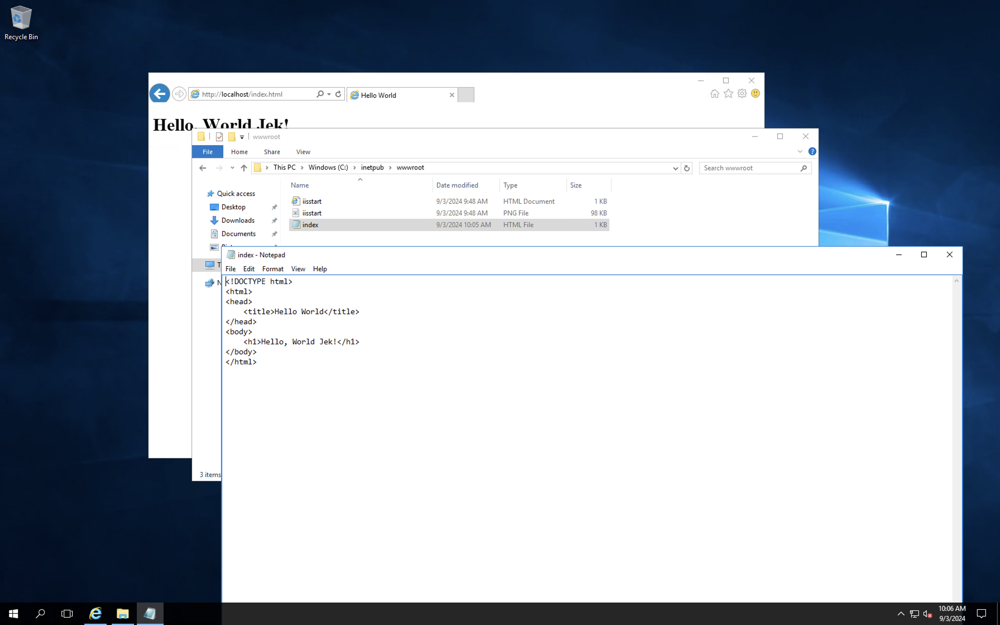
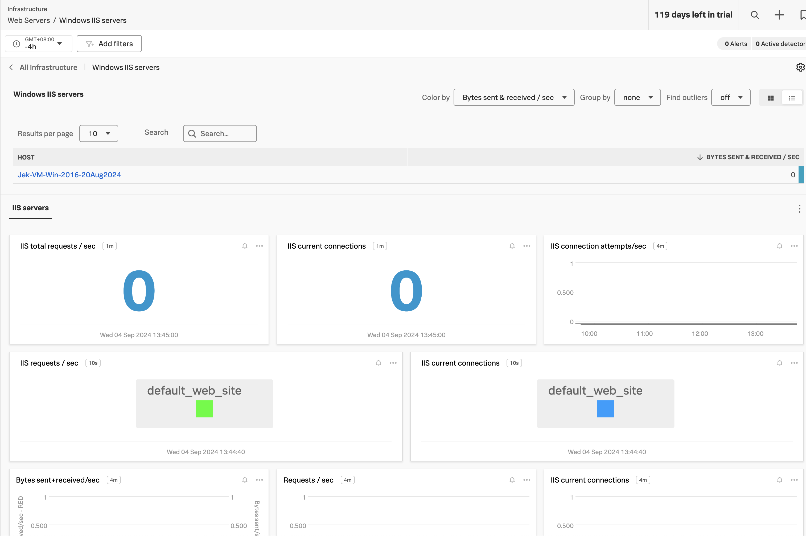

# Setup OTel Collector on Windows 2016

Check if it's admin
`[Security.Principal.WindowsIdentity]::GetCurrent().Groups -contains 'S-1-5-32-544'`
This will return True if you're running as admin, and False if not.

Check the version of PowerShell
`$PSVersionTable`

1. Run this script if the function provided by Splunk didn't work:
```Powershell
function Get-ScriptContent {
    param($Uri)
    try {
        [Net.ServicePointManager]::SecurityProtocol = [Net.SecurityProtocolType]::Tls12
        return Invoke-RestMethod -Uri $Uri -UseBasicParsing
    }
    catch {
        Write-Host "Error downloading script: $_"
        return $null
    }
}
```

2. Now, let's modify your original command to use this function:
```Powershell
& {
    Set-ExecutionPolicy Bypass -Scope Process -Force
    $scriptContent = Get-ScriptContent -Uri 'https://dl.signalfx.com/splunk-otel-collector.ps1'
    if ($null -eq $scriptContent) {
        Write-Host "Failed to download the script. Please check your internet connection and try again."
        return
    }
    $params = @{
        access_token = "< your access token >"
        realm = "us1"
        mode = "agent"
        with_dotnet_instrumentation = 0
    }
    $scriptBlock = [Scriptblock]::Create($scriptContent)
    & $scriptBlock @params
}
```

---

# Setup IIS on Windows Server 2016

1. Install IIS on Windows Server 2016:

- Open Server Manager
- Click "Add roles and features"
- Choose "Role-based or feature-based installation"
- Select your server from the server pool
- In the "Server Roles" section, check "Web Server (IIS)"
- Click "Add Features" when prompted
- Continue through the wizard, leaving default options
- Click "Install" and wait for the process to complete


2. Verify IIS installation:

- Open a web browser on the server
- Navigate to http://localhost
- You should see the default IIS welcome page

3. Create a simple "Hello World" application:

- Open Notepad (or any text editor)
- Enter the following HTML:

```html
<!DOCTYPE html>
<html>
<head>
    <title>Hello World</title>
</head>
<body>
    <h1>Hello, World!</h1>
</body>
</html>
```

Save the file as "index.html" in `C:\inetpub\wwwroot\`

4. Test the application:

- Open a web browser on the server
- Navigate to http://localhost/index.html
- You should see "Hello, World Jek!" displayed




5. Allow incoming traffic (if needed):

- Open Windows Firewall with Advanced Security
- Create a new Inbound Rule
- Choose "Port" and specify TCP port 80
- Allow the connection
- Apply the rule to Domain, Private, and Public profiles
- Name the rule (e.g., "IIS Web Server")


6. Access from another machine (optional):

- Find the server's IP address using ipconfig in Command Prompt
- From another machine on the same network, try accessing http://<server-ip>/index.html


---

# Add OTel Collector Receiver for IIS

- Open PowerShell ISE (it's pre-installed on Windows Server 2016)
- 
- File > Open

- Go to `\ProgramData\Splunk\OpenTelemetry Collector\agent_config.yaml` using PowerShell ISE: The default configuration file for the Splunk OpenTelemetry Collector to add

```yml
receivers:
  smartagent/windows-iis:
    type: windows-iis
```

```yml
service:
  pipelines:
    metrics:
      receivers: [smartagent/windows-iis]
```

    Optionally: 
    - The value Environment at the HKLM:\SYSTEM\CurrentControlSet\Services\splunk-otel-collector registry key contains the environment variables used by the default configuration file:
        - SPLUNK_ACCESS_TOKEN: The Splunk access token to authenticate requests
        - SPLUNK_API_URL: The Splunk API URL, e.g. https://api.us1.signalfx.com
        - SPLUNK_CONFIG: The path to the collector config file, e.g. C:\ProgramData\Splunk\OpenTelemetry Collector\agent_config.yaml
        - SPLUNK_HEC_TOKEN: The Splunk HEC authentication token (if log collection is enabled)
        - SPLUNK_HEC_URL: The Splunk HEC endpoint URL, e.g. https://ingest.us1.signalfx.com/v1/log (if log collection is enabled)
        - SPLUNK_INGEST_URL: The Splunk ingest URL, e.g. https://ingest.us1.signalfx.com
        - SPLUNK_MEMORY_TOTAL_MIB: Total memory in MiB allocated to the collector, e.g. 512
        - SPLUNK_REALM: The Splunk realm to send the data to, e.g. us1
        - SPLUNK_TRACE_URL: The Splunk trace endpoint URL, e.g. https://ingest.us1.signalfx.com/v2/trace

After modifying the configuration file or registry key, apply the changes by restarting the system or running the following PowerShell commands:

```powershell
Stop-Service splunk-otel-collector
Start-Service splunk-otel-collector
Get-Service splunk-otel-collector
Get-Service splunk-otel-collector | Select-Object Name, Status, StartType, DisplayName
Get-Process -Name *otel*
```



