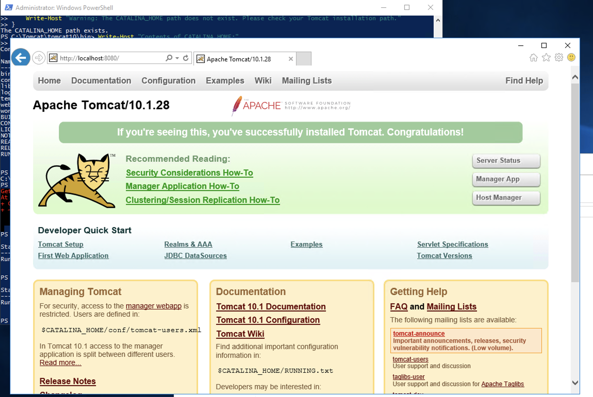

1. Install Java Development Kit (JDK):
```powershell
# Set variables
[Net.ServicePointManager]::SecurityProtocol = [Net.SecurityProtocolType]::Tls12

Test-NetConnection -ComputerName www.github.com

$jdkUrl = "https://github.com/adoptium/temurin11-binaries/releases/download/jdk-11.0.19%2B7/OpenJDK11U-jdk_x64_windows_hotspot_11.0.19_7.msi"
$downloadPath = "C:\Temp\OpenJDK11.msi"

New-Item -ItemType Directory -Force -Path C:\Temp

Invoke-WebRequest -Uri $jdkUrl -OutFile $downloadPath -UseBasicParsing

if (Test-Path $downloadPath) {
    Write-Host "MSI file downloaded successfully"
} else {
    Write-Host "Download failed"
}

$process = Start-Process -FilePath msiexec -ArgumentList "/i `"$downloadPath`" /qn /L*v C:\Temp\jdk_install_log.txt" -Wait -PassThru -Verb RunAs
if ($process.ExitCode -eq 0) {
    Write-Host "Installation successful"
} else {
    Write-Host "Installation failed with exit code: $($process.ExitCode)"
    Get-Content C:\Temp\jdk_install_log.txt | Select-Object -Last 20
}

# Set JAVA_HOME environment variable
$javaHome = "C:\Program Files\Eclipse Adoptium\jdk-11.0.19.7-hotspot"
[Environment]::SetEnvironmentVariable("JAVA_HOME", $javaHome, "Machine")

# Verify JAVA_HOME is set correctly
$env:JAVA_HOME = [System.Environment]::GetEnvironmentVariable("JAVA_HOME", "Machine")
Write-Host "JAVA_HOME is set to: $env:JAVA_HOME"

# Add Java to PATH
$path = [Environment]::GetEnvironmentVariable("Path", "Machine")
$newPath = "$javaHome\bin;" + $path
[Environment]::SetEnvironmentVariable("Path", $newPath, "Machine")

Write-Host "Java has been added to the system PATH"

# Verify installation
java -version
javac -version
```

2. Install Apache Tomcat:
```powershell

# Set TLS 1.2
[Net.ServicePointManager]::SecurityProtocol = [Net.SecurityProtocolType]::Tls12

# Variables
$tomcatVersion = "10.1.28"
$downloadUrl = "https://dlcdn.apache.org/tomcat/tomcat-10/v$tomcatVersion/bin/apache-tomcat-$tomcatVersion-windows-x64.zip"
$downloadPath = "C:\Temp\apache-tomcat-$tomcatVersion.zip"
$extractPath = "C:\Tomcat"

# Create temp directory if it doesn't exist
New-Item -ItemType Directory -Force -Path C:\Temp

# Download Tomcat
Invoke-WebRequest -Uri $downloadUrl -OutFile $downloadPath -UseBasicParsing

if (Test-Path $downloadPath) {
    Write-Host "Tomcat file downloaded successfully"
} else {
    Write-Host "Download failed"
}

# Extract Tomcat
Expand-Archive -Path $downloadPath -DestinationPath $extractPath -Force

# Rename extracted folder
Rename-Item -Path "$extractPath\apache-tomcat-$tomcatVersion" -NewName "tomcat10"

# Set CATALINA_HOME environment variable
[Environment]::SetEnvironmentVariable("CATALINA_HOME", "$extractPath\tomcat10", "Machine")

# Add Tomcat bin to PATH
$path = [Environment]::GetEnvironmentVariable("Path", "Machine")
$newPath = "$extractPath\tomcat10\bin;" + $path
[Environment]::SetEnvironmentVariable("Path", $newPath, "Machine")

# Create Tomcat service
$tomcatBin = "$extractPath\tomcat10\bin"
Set-Location $tomcatBin
.\service.bat install

# Start Tomcat service
Start-Service -Name "Tomcat10"

# Set the path to your Tomcat installation
$tomcatPath = "C:\Tomcat\tomcat10"

# Set CATALINA_HOME environment variable
[Environment]::SetEnvironmentVariable("CATALINA_HOME", $tomcatPath, "Machine")

# Refresh environment variables in the current session
$env:CATALINA_HOME = [System.Environment]::GetEnvironmentVariable("CATALINA_HOME", "Machine")

# Verify CATALINA_HOME
Write-Host "CATALINA_HOME is set to: $env:CATALINA_HOME"

# Check if the path exists
if (Test-Path $env:CATALINA_HOME) {
    Write-Host "The CATALINA_HOME path exists."
} else {
    Write-Host "Warning: The CATALINA_HOME path does not exist. Please check your Tomcat installation path."
}

# List contents of CATALINA_HOME to further verify
Write-Host "Contents of CATALINA_HOME:"
Get-ChildItem $env:CATALINA_HOME | Select-Object Name

# Output status
Write-Host "Tomcat has been installed and started. CATALINA_HOME is set to: $env:CATALINA_HOME"
Write-Host "Tomcat service status:"
Get-Service -Name "Tomcat10" | Select-Object Name, Status, StartType

Get-Service -Name "Tomcat10"

```

If Tomcat is not a service:

To stop: Run `C:\Tomcat\tomcat10\bin\shutdown.bat`
To start: Run `C:\Tomcat\tomcat10\startup.bat`
To check status:

try accessing http://localhost:8080 in a web browser



---

Deploy your Java application:

Place the MyWebApp.war file in the `C:\Tomcat\tomcat10\webapps` directory


Restart Tomcat and check Tomcat status:

```powershell

Restart-Service -Name "Tomcat10"

Get-Service -Name "Tomcat10"

```


Verify the WAR is working correctly:

Open a web browser and go to http://localhost:8080


---

Add splunk-otel-javaagent.jar to the Java app.
