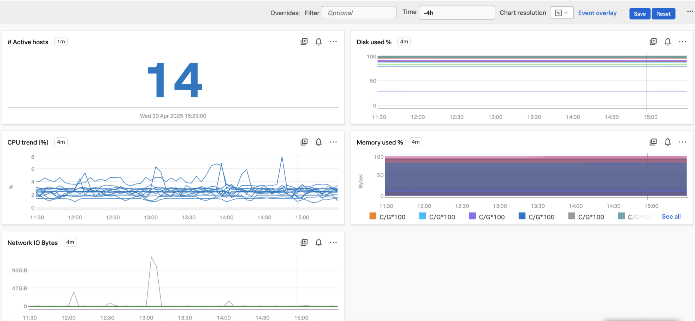

Thanks to the work of my colleague MB.

According to him, to monitor AIX with O11y cloud, can use following steps (community support for exporter). It'll consume custom metrics though. Simpler approach as compared to njmon.

```
wget https://github.com/thorhs/node_exporter_aix/releases/download/v1.14.3/node_exporter_aix.1.14.3.0.bff.gz
gunzip node_exporter_aix.1.14.3.0.bff.gz
installp -ac -d node_exporter_aix.1.14.3.0.bff node_exporter_aix
startsrc -s node_exporter_aix
curl localhost:9100

Use prometheus receiver to scrape metrics
```

