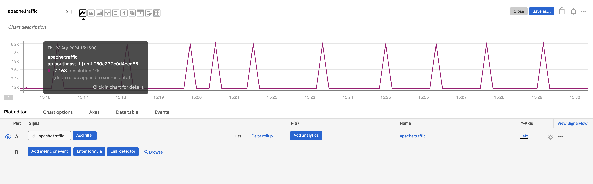

Apache2

# Initial setup

Update the system:

`sudo apt update && sudo apt upgrade -y`

Install Apache HTTP Server:

`sudo apt install apache2 -y`

Start Apache and enable it to run on boot:

`sudo systemctl start apache2`

`sudo systemctl enable apache2`

Check Apache status:

`sudo systemctl status apache2`

Create a simple web app (for example, a PHP file):

`sudo nano /var/www/html/index.php`

Add some basic PHP code to the file:

```html
<?php
echo "<h1>Hello, World!</h1>";
echo "This is a simple web app running on Apache.";
?>
```

Install PHP support for Apache:

`sudo apt install libapache2-mod-php -y1`

Restart Apache to apply changes:

`sudo systemctl restart apache2`

Open your web browser and navigate to your server's IP address or domain name to see your web app.

# What else do we need?
mod_status

mod_status is a powerful tool for monitoring Apache HTTP Server, and it can be effectively integrated with OpenTelemetry to provide comprehensive observability. Here's an explanation of its usefulness and potential integration:

Usefulness of mod_status for monitoring:

mod_status provides real-time statistics about the Apache server's performance and activity. It offers information such as:

Current server uptime
Total accesses and traffic
CPU load and usage
Current number of busy and idle workers
Requests per second
Bytes served per second
Individual request details (URL, status, duration)

This data is crucial for understanding server performance, identifying bottlenecks, and capacity planning.

Integrating mod_status with OpenTelemetry:

OpenTelemetry can be used to collect, process, and export the metrics provided by mod_status. Here's how you might approach this integration:
a) Data Collection:

Use the OpenTelemetry Collector to scrape the mod_status endpoint periodically.
Configure the collector to parse the mod_status output and convert it into OpenTelemetry metrics.

b) Metric Definition:

Define custom metrics in OpenTelemetry format that correspond to the mod_status data.
Examples include:

apache.requests_per_second
apache.bytes_per_second
apache.workers.busy
apache.workers.idle

# How to check if mod_status is enabled?
To check if mod_status is enabled on your Apache HTTP Server, you can follow these steps:

Check if the module is loaded:

`apache2ctl -M | grep status`

If mod_status is enabled, you should see output like:
status_module (shared)

Alternatively, you can check the configuration files:

`ls /etc/apache2/mods-enabled | grep status`

If you see status.conf and status.load in the output, it means mod_status is enabled.

You can also check the Apache configuration file directly:
`cat /etc/apache2/mods-enabled/status.conf | grep server-status -a5` 
https://httpd.apache.org/docs/2.4/mod/mod_status.html The old article says look for httpd.conf but in newer version it's in /etc/apache2/mods-enabled/status.conf as status.conf.
https://ubuntu.com/server/docs/how-to-install-apache2#files 

To verify if mod_status is working, you can try accessing the server-status page:

`curl http://localhost/server-status`

`curl http://127.0.0.1:80/server-status`

`curl http://127.0.0.1:80/server-status?auto`

Note that by default, access to this page is often restricted to localhost for security reasons.

If mod_status is not enabled and you want to enable it, you can use:

`sudo a2enmod status`

`sudo systemctl restart apache2`

# Config OTel Collector

Do not use the collectd/apache receiver. Use the OTel apache receiver https://docs.splunk.com/observability/en/gdi/opentelemetry/components/apache-receiver.html#apache-receiver

```yml
receivers:
  apache:
    endpoint: "http://127.0.0.1:80/server-status?auto"
    collection_interval: 1s
```

```yml
service:
  pipelines:
    metrics:
      receivers: [hostmetrics, otlp, signalfx, smartagent/tomcat, apache]

```

`sudo systemctl restart splunk-otel-collector.service`

`sudo systemctl status splunk-otel-collector.service`

View the logs if there are problem

`journalctl -xeu splunk-otel-collector.service`



# Other ref
- https://github.com/billg-splunk/splunk-metrics-oc