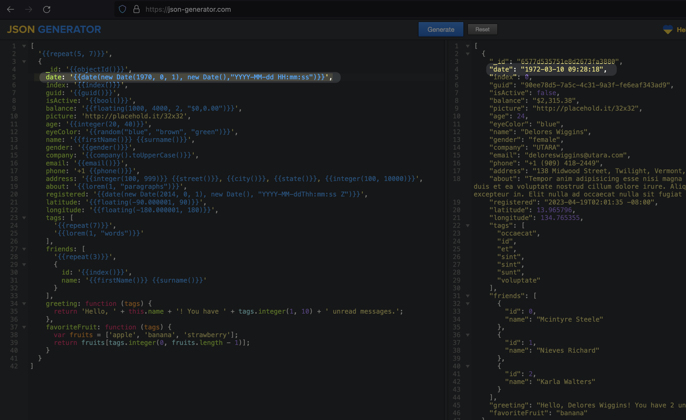
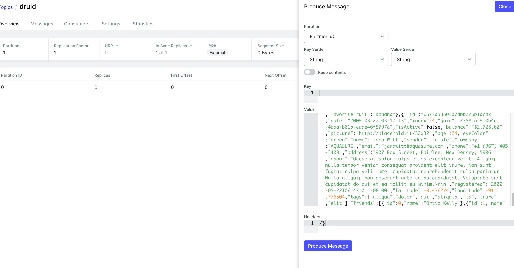

# Get network IP address

# Start Kafka
`docker run --rm -d -p 9092:9092 -e ADV_HOST=192.168.0.106 \
--name local-kafka lensesio/fast-data-dev:latest`

# Start Kafka UI
`docker run --rm -d -p 8000:8080 -e DYNAMIC_CONFIG_ENABLED=true \
--name kafka-ui provectuslabs/kafka-ui`

# Create Kafka cluster

If error connecting, try `advertised.listeners=PLAINTEXT://192.168.XXX.106:9092` in the above step and check out https://stackoverflow.com/questions/67763076/connection-to-node-1-127-0-0-19092-could-not-be-established-broker-may-not 

# Create Kafka topic

# Generate sample json for Kafka Topic to Druid
https://json-generator.com/
Druid requires date field in this format:

`date: '{{date(new Date(1970, 0, 1), new Date(),"YYYY-MM-dd HH:mm:ss")}}',`

# Start Apache Druid
Follow the instruction to add docker-compose.yml and environment files in the folder 
- https://druid.apache.org/docs/latest/tutorials/docker/ 
- https://github.com/apache/druid/tree/master/distribution/docker

Include the `druid-kafka-indexing-service` in `druid.extensions.loadList` of the environment file  then run:

`docker-compose up -d`

Optionally can access the container with `docker exec -ti <id> sh`
    - There is also helm chart installation for k8s users. https://github.com/apache/druid/tree/master/helm/druid
Navigate to the web console at http://localhost:8888

# Load data from Kafka to Druid

`SELECT 
  "__time"
  FROM "druid"`

# Reference
udemy.com/course/apache-druid-complete-guide/learn/lecture/38970672#overview

---

# Presto

