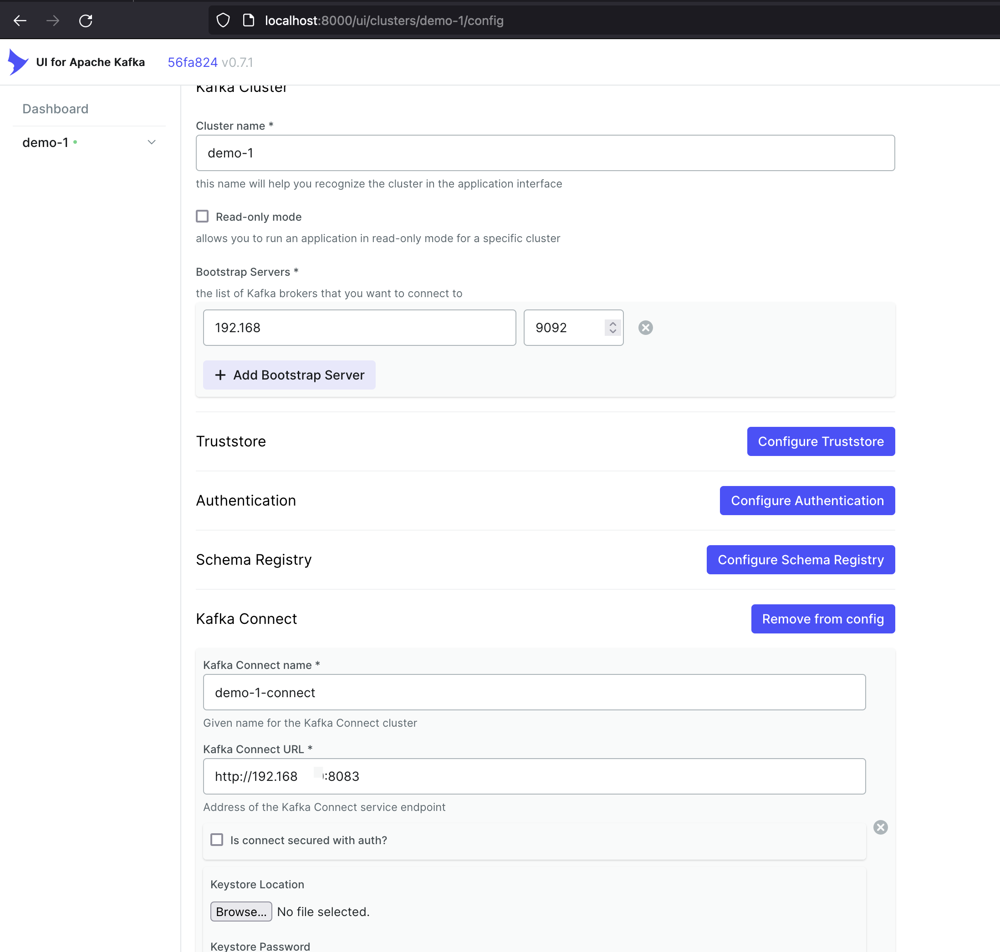
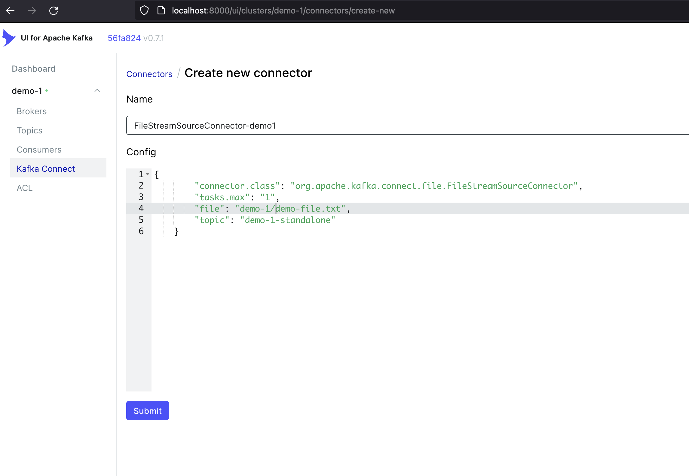

# Get network IP address


---

# Optional: Demo 1 (Kafka Connect Source)
- Local Kafka `docker run --rm -d -p 9092:9092 -p 8083:8083 -e ADV_HOST=192.168.XXX.XXX -v "$(pwd)"/demo-1:/demo-1 --name demo-1-kafka lensesio/fast-data-dev:latest`
- Kafka UI `docker run --rm -d -p 8000:8080 -e DYNAMIC_CONFIG_ENABLED=true --name kafka-ui provectuslabs/kafka-ui`

### Test that Kafka UI is working by creating kakfa cluster + Kafka Connect
Go to http://localhost:8000



If error connecting, try `advertised.listeners=PLAINTEXT://192.168.XXX.106:9092` in the above step and check out https://stackoverflow.com/questions/67763076/connection-to-node-1-127-0-0-19092-could-not-be-established-broker-may-not 

### Create Kafka Connector

```json
{
        "connector.class": "org.apache.kafka.connect.file.FileStreamSourceConnector",
        "tasks.max": "1",
        "file": "demo-1/demo-file.txt",
        "topic": "demo-1-standalone"
    }
```




### Edit the file in demo-1/demo-file.txt


---

# Optional: Demo 2 (Kafka Connect Sink)

---

# Create Kafka Cluster with Kafka Connect, Elastic, and PostgreSQL via Docker Compose
- Create the docker-compose.yml with kafka cluster
- Change the docker-compose.yml to use the network ip address.
    - Change this 192.168.XXX.XXX
- `docker compose up -d`
- Test that it is working navigating to 127.0.0.1:3030
    - View logs http://localhost:3030/logs/

# Test that Kafka UI is working
Go to http://localhost:8000


If error connecting, try `advertised.listeners=PLAINTEXT://192.168.XXX.106:9092` in the above step and check out https://stackoverflow.com/questions/67763076/connection-to-node-1-127-0-0-19092-could-not-be-established-broker-may-not 

# Create Kafka topic

