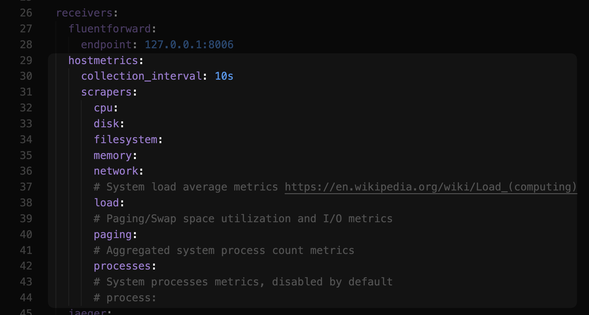
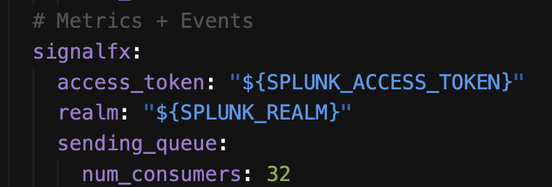

Apparently, this config works in collecting host metrics while running in gateway mode. 

To be down to the basic. The key change is essentially adding hostmetrics  to receiver's metric pipeline . The metric pipeline also exports metrics via signalfx 