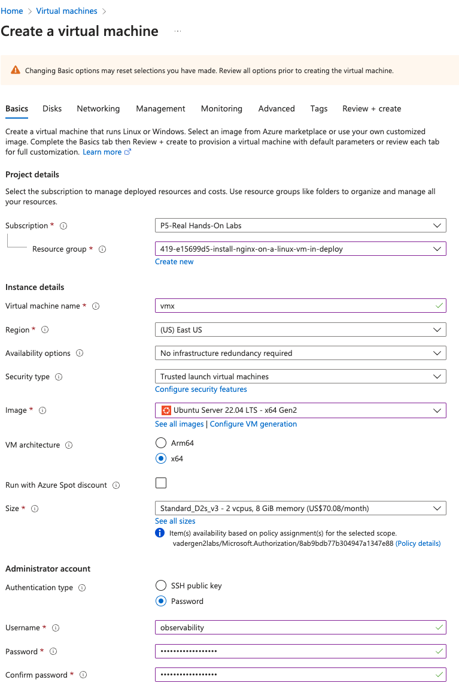
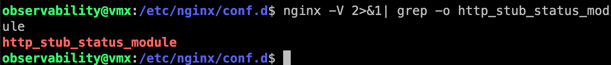

# Deploy a Linux VM with NGINX Installed
- Create the Ubuntu VM 
- In the advanced step add to Custom data box the following `cloud-init` yaml script:
```yml
#cloud-config
packages_upgrade: true
packages:
  - nginx
```
- 

# Test the VM
- 

# Install Splunk OTel Collector
- Follow the Data Management > Linux wizard in Splunk Observability Cloud portal

# Configure Nginx to expose status info
- You can configure NGINX to expose status information by editing the NGINX configuration. 
- Verify required  `ngx_http_stub_status_module` is installed 
- `nginx -V 2>&1| grep -o http_stub_status_module` 
- After you’ve set up the Collector, follow these steps to configure the Nginx web server to expose status metrics. Create NGINX Status Endpoint. Create a file under `sudo vim /etc/nginx/conf.d/nginx_status.conf`
```
server {
  listen 8080;

  location = /nginx_status {
    #stab_status on;
    stub_status;
    access_log off;
    allow 127.0.0.1; # The source IP address of OpenTelemetry Collector.
    deny all;
  }
}
```
- Restart the Nginx web server. 
- `sudo nginx -s reload`

# Add Nginx receiver to Splunk OTel Collector via conf
- To activate this integration, add the following to your Collector configuration:
- `sudo vim /etc/otel/collector/agent_config.yaml`
```yml
smartagent/nginx:
    type: collectd/nginx
    host: 127.0.0.1
    port: 8080
    name: nginx
```
- Next, add the monitor to the `service.pipelines.metrics.receivers`` section of your configuration file:
```
service:
  pipelines:
    metrics:
      receivers: [smartagent/nginx]
    logs:
      receivers: [smartagent/nginx]
```
- Remember to restart the otel collector `sudo systemctl restart splunk-otel-collector`
- Check the status `sudo systemctl status splunk-otel-collector`

# Test
- `while true; do curl localhost; sleep 1; done`

# Proof


# Reference
- https://docs.splunk.com/Observability/gdi/monitors-hosts/nginx.html
- https://github.com/mcheo/getting-data-in/tree/main/non-k8s/instrument-nginx-metrics

