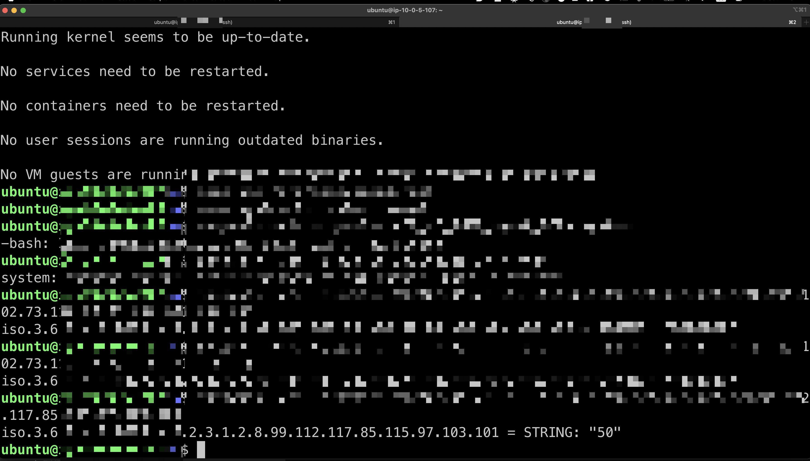
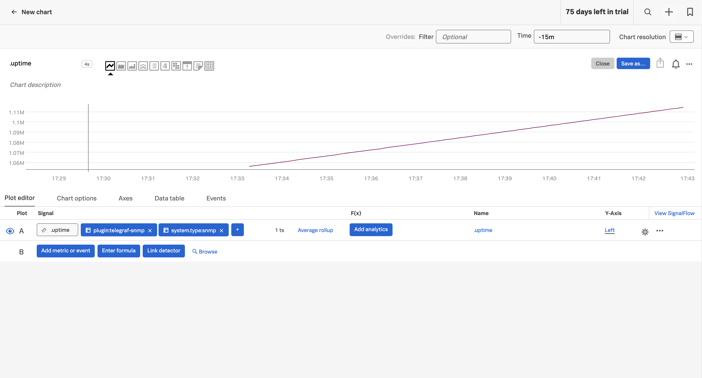
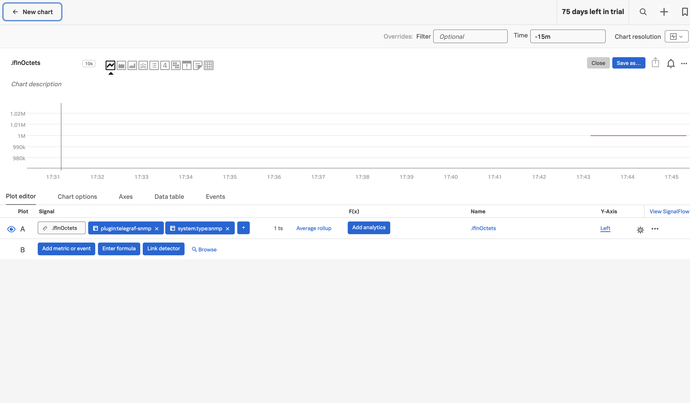
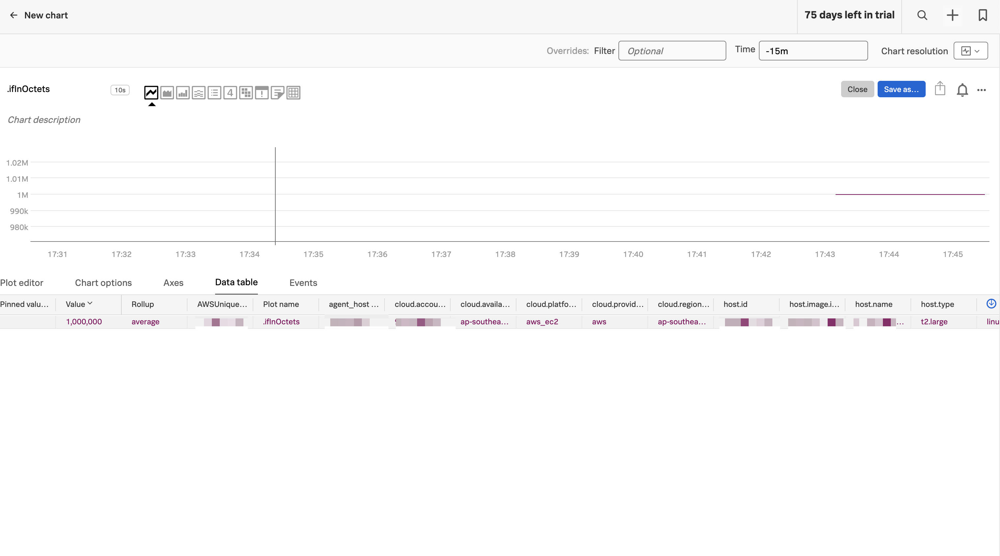
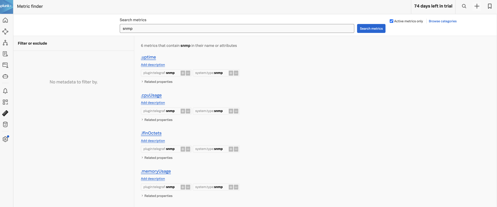

This step through would simulate network devices using SNMPD. After which, we will monitor the simulated network device metrics using SNMP receiver.

# Spin up an EC2 Ubuntu instance to simulate a network device using snmpd and install SNMP to monitor the CPU and memory usage of the simulated device.

Install snmpd:

```
sudo apt update
sudo apt install snmpd snmp
```

Configure snmpd:

```
sudo vim /etc/snmp/snmpd.conf
```


Verify that the content has these:
```
# Basic SNMP configuration
rocommunity public localhost
sysLocation "Jek Data Center"
sysContact "Jek Admin <admin@example.com>"

# Extend SNMP with custom scripts
# CPU Usage - OID: .1.3.6.1.4.1.2021.10.1.3.1
extend cpuUsage /bin/sh -c "top -bn1 | grep 'Cpu(s)' | awk '{print $2}'"

# Memory Usage - OID: .1.3.6.1.4.1.2021.4
view systemview included .1.3.6.1.2.1.25.2.2
view systemview included .1.3.6.1.4.1.2021.4

# Interface Statistics - OID: .1.3.6.1.2.1.2.2.1.10
view systemview included .1.3.6.1.2.1.2
```

Restart snmpd:

```
sudo systemctl restart snmpd
```

## Test the setup:


test a specific OID (1.3.6.1.2.1.1 is the system MIB):
```
snmpwalk -v2c -c public localhost 1.3.6.1.2.1.1 

snmpwalk -v2c -c public localhost 1.3.6.1.2.1.25.1
```


# Spin up a second EC2 Ubuntu instance for monitoring the simulated device remotely
Install snmp:

```
sudo apt update
sudo apt install snmp
```

## Configure snmpd on the first EC2 (SNMP agent):

Edit /etc/snmp/snmpd.conf:

```
sudo nano /etc/snmp/snmpd.conf
```

Add or modify these lines:

```
rocommunity public <IP_of_monitoring_EC2>
agentAddress udp:161,udp6:[::1]:161

```
Replace `<IP_of_monitoring_EC2>` with the actual IP of your second EC2.


Restart snmpd:

```
sudo systemctl restart snmpd
```

Adjust EC2 Security Group:

- In the AWS Console, go to the Security Group for the EC2 running snmpd.
- Add an inbound rule: Type: Custom UDP, Port Range: 161, Source: `<IP_of_monitoring_EC2>/32`


## On the monitoring EC2, test the connection in the second EC2 instance:


For ifInOctets:
```
snmpwalk -v2c -c public <IP_of_SNMP_agent_EC2> .1.3.6.1.4.1.8072.1.3.2.3.1.2.10.105.102.73.110.79.99.116.101.116.115
```

For CPU usage:
```
snmpwalk -v2c -c public <IP_of_SNMP_agent_EC2> .1.3.6.1.4.1.8072.1.3.2.3.1.2.8.99.112.117.85.115.97.103.101
```

For memory usage:
```
snmpwalk -v2c -c public <IP_of_SNMP_agent_EC2> .1.3.6.1.4.1.8072.1.3.2.3.1.2.8.109.101.109.85.115.97.103.101
```

Replace `<IP_of_SNMP_agent_EC2>` with the actual IP or hostname of the first EC2.

Configure your SNMP monitoring tool on the second EC2 to query the first EC2:

- Use the IP address of the first EC2 as the target
Use 'public' as the community string (or whatever you set in step 1)
- Use UDP port 161
Set up queries for the OIDs you're interested in:

- ifInOctets: .1.3.6.1.4.1.8072.1.3.2.3.1.2.10.105.102.73.110.79.99.116.101.116.115
- CPU usage: .1.3.6.1.4.1.8072.1.3.2.3.1.2.8.99.112.117.85.115.97.103.101
- Memory usage: .1.3.6.1.4.1.8072.1.3.2.3.1.2.8.109.101.109.85.115.97.103.101



## Now use SNMPv3 instead SNMPv2 for better security (set this up in your first EC2 terminal)
First, stop the snmpd service:

```
sudo systemctl stop snmpd
```

Create an SNMPv3 user with the net-snmp-create-v3-user command:

```
sudo net-snmp-create-v3-user -ro -A YourAuthPass123! -a SHA -X YourPrivPass456! -x AES snmpv3user
```

Replace `'YourAuthPass123!'` and `'YourPrivPass456!'` with strong, unique passwords of your choice.

This command automatically adds the user to `/var/lib/snmp/snmpd.conf` (not `/etc/snmp/snmpd.conf`).

Now, edit /etc/snmp/snmpd.conf:

```
sudo vim /etc/snmp/snmpd.conf
```

Add or modify these lines:

```
rouser snmpv3user authpriv
view systemview included .1.3.6.1.2.1.1
view systemview included .1.3.6.1.2.1.25.1
view systemview included .1.3.6.1.4.1.8072.1.3.2
```

Save the file and exit the VIM.

Restart snmpd:

```
sudo systemctl start snmpd
```

test the configuration with in the 2nd EC2 instance:
```
snmpwalk -v3 -l authPriv -u snmpv3user -a SHA -A YourAuthPass123! -x AES -X YourPrivPass456! <THE IP ADDRESS OF THE FIRST EC2> .1.3.6.1.4.1.8072.1.3.2.3.1.2.8.109.101.109.85.115.97.103.101
```


In this setup:
- You don't directly put the passwords in snmpd.conf.
- The net-snmp-create-v3-user command creates the user with encrypted credentials.
- The 'rouser' line in snmpd.conf specifies that 'snmpv3user' has read-only access when using both authentication and privacy.
- Replace 'YourAuthPass123!' and 'YourPrivPass456!' with your actual chosen passwords in both the user creation command and when running snmpwalk.

## Add OpenTelemetry in the second EC2 instance

Install Splunk OpenTelemetry Collector.

Add Splunk's documentation recommended telegraf/snmp (this is not OTel SNMP receiver).

```yaml
receivers:
  smartagent/snmp:
    type: telegraf/snmp
    agents:
    - "<The first EC2 host ip address>:161"
    version: 2
    community: "public"
    #secLevel: "authPriv"
    #secName: "snmpv3user"
    #authProtocol: "SHA"
    #authPassword: "YourAuthPass123!"
    #privProtocol: "AES"
    #privPassword: "YourPrivPass456!"
    fields:
    - name: "uptime"
      oid: ".1.3.6.1.2.1.1.3.0"
    - name: "ifInOctets"
      oid: ".1.3.6.1.4.1.8072.1.3.2.3.1.2.10.105.102.73.110.79.99.116.101.116.115"
      conversion: "int"
    - name: "cpuUsage"
      oid: ".1.3.6.1.4.1.8072.1.3.2.3.1.2.8.99.112.117.85.115.97.103.101"
      conversion: "int"
    - name: "memoryUsage"
      oid: ".1.3.6.1.4.1.8072.1.3.2.3.1.2.8.109.101.109.85.115.97.103.101"
      conversion: "int"
```

```yml
service:
  pipelines:
    metrics:
      receivers: [hostmetrics, otlp, signalfx, smartagent/snmp]
```

`sudo systemctl restart splunk-otel-collector`

`sudo systemctl status splunk-otel-collector`

Go to Splunk Observability Cloud.




