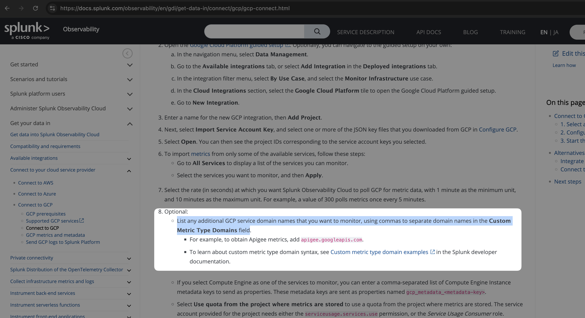
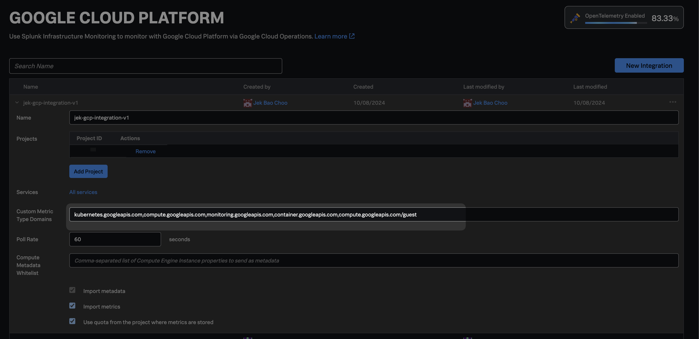
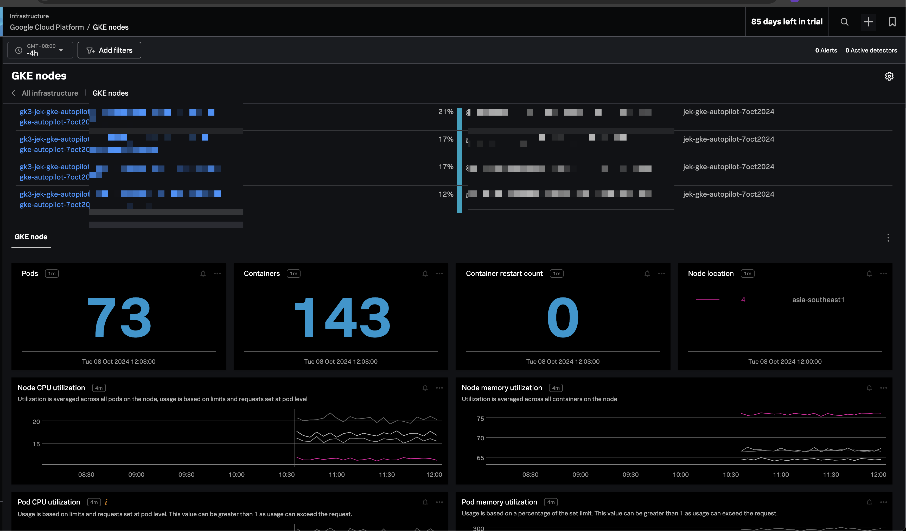

# Create GCP Service Account with permissions

- Authenticate using Google Cloud SDK CLI: `gcloud auth login`

- Get the project id `gcloud projects list`

- Update create_sa_with_permissions.sh with the project id and service account name to today's date.

- Make the script executable: `chmod +x create_sa_with_permissions.sh`

- Run the script: `./create_sa_with_permissions.sh`

# After which, follow the relevant steps:
- https://docs.splunk.com/observability/en/gdi/get-data-in/connect/gcp/gcp-connect.html

## List List any additional GCP service domain names that you want to monitor in the Custom Metric Type Domains field

For example: `kubernetes.googleapis.com,compute.googleapis.com,monitoring.googleapis.com,container.googleapis.com,compute.googleapis.com/guest`

More information here:
- https://docs.splunk.com/observability/en/gdi/integrations/cloud-gcp.html#cloud-gcp

- https://cloud.google.com/monitoring/api/metrics_gcp

- https://dev.splunk.com/observability/docs/integrations/gcp_integration_overview/#Custom-metric-type-domains 

- https://cloud.google.com/monitoring/api/v3/naming-conventions

- https://docs.splunk.com/observability/en/gdi/get-data-in/connect/gcp/gcp-connect.html#start-the-integration

