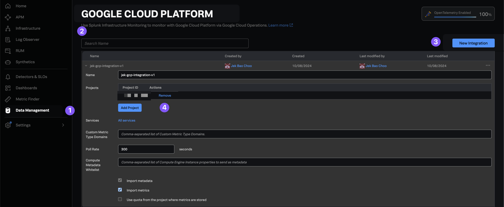

# Create GCP Service Account with permissions

- Authenticate using Google Cloud SDK CLI: `gcloud auth login`

- Get the project id `gcloud projects list`

- Update create_sa_with_permissions.sh with the project id and service account name to today's date.

- Make the script executable: `chmod +x create_sa_with_permissions.sh`

- Run the script: `./create_sa_with_permissions.sh`

# After which, follow the relevant steps:
- https://docs.splunk.com/observability/en/gdi/get-data-in/connect/gcp/gcp-connect.html

