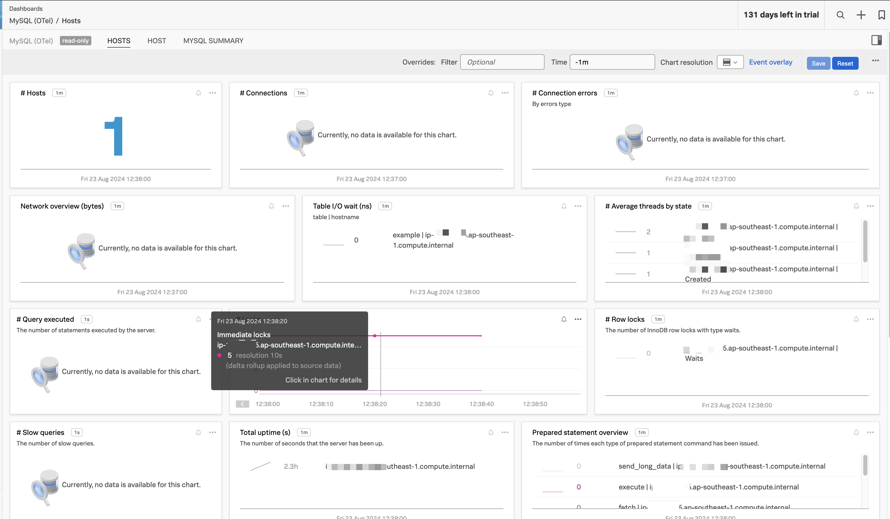
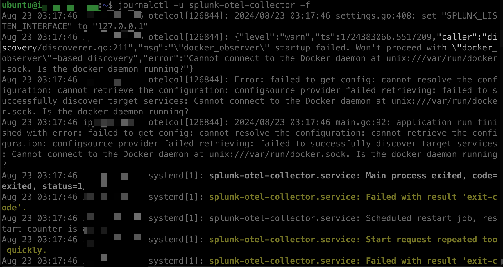
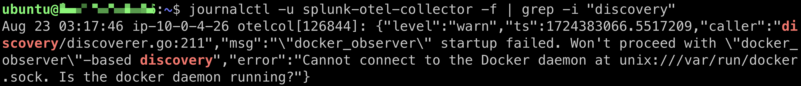
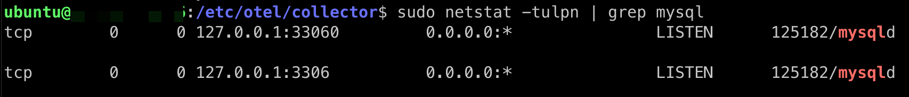

Read this to get started with MySQL installation on Ubuntu.

https://www.digitalocean.com/community/tutorials/how-to-install-mysql-on-ubuntu-22-04


# After MySQL setup complete.
Connect to MySQL using the credential provided in the above DigitalOcean tutorial.

`mysql -u sammy -p`

The password is `password`.

Alternatively, you can use the MySQL client from the command line as root user: `mysql -u root -p`. The password is `password`.

Show databases:

`SHOW DATABASES;`

Create a tmp database:

`CREATE DATABASE tmp;`

Use the tmp database:

`USE tmp;`

Create a table:

```sql
CREATE TABLE example (
    id INT AUTO_INCREMENT PRIMARY KEY,
    name VARCHAR(50),
    age INT
);
```

Insert a few rows:

```sql
INSERT INTO example (name, age) VALUES
('Alice', 30),
('Bob', 25),
('Charlie', 35);
```

Select all from the table:

`SELECT * FROM example;`



# ~~Install OTel Collector with discovery mode for MySQL but...~~

### Add the time of writing this auto discovery isn't working for me so I cancelled the section below!!!


```bash
curl -sSL https://dl.signalfx.com/splunk-otel-collector.sh > /tmp/splunk-otel-collector.sh && \
sudo sh /tmp/splunk-otel-collector.sh --realm us1 -- < your access token> --mode agent --without-instrumentation --discovery
```

~~After which follow this guide to configure the MySQL with the use of discovery mode: https://docs.splunk.com/observability/en/gdi/opentelemetry/automatic-discovery/linux/linux-third-party.html#usage-example~~


~~Retrieve the Collector logs with the following command and review the output of the discovery process:~~

`journalctl -u splunk-otel-collector -f`

`journalctl -xeu splunk-otel-collector.service`

 ~~The error message indicates the problem:~~


`journalctl -u splunk-otel-collector -f | grep -i "discovery"`



~~Provide the necessary credentials by creating the properties.discovery.yaml file in the /etc/otel/collector/config.d directory with the following content~~

`sudo vim /etc/otel/collector/config.d/properties.discovery.yaml` 

~~Add~~

```yaml
splunk.discovery.receivers.mysql.config.username: "sammy"
splunk.discovery.receivers.mysql.config.password: "password"
```

~~More more detailed explanation read this https://github.com/signalfx/splunk-otel-collector/tree/main/internal/confmapprovider/discovery#discovery-properties~~

~~After adding the properties.discovery.yaml file, do a daemon reload because it could hit-start-limit for some reasons then restart the collector:~~

`sudo systemctl daemon-reload`

`sudo systemctl start splunk-otel-collector`

`sudo systemctl status splunk-otel-collector`

~~If auto discovery isn't working, try manual discovery after having otelcol installed and active then try `otelcol --discovery --dry-run --config /etc/otel/collector/splunk-otel-collector.conf`~~

# Use manual add instead of auto discovery for the MySQL receiver!

From the initial setup we know the following that username is sammy and the password:

`mysql -u sammy -p`

The password is `password`.

Alternatively, you can use the MySQL client from the command line as root user: `mysql -u root -p`. The password is `password`.

We also know that earlier we created a database called tmp using `CREATE DATABASE tmp;`

The next step is to find out the port number of the MySQL server.
`sudo netstat -tulpn | grep mysql`


there are two ports shown for MySQL:

- 33060
- 3306

The standard MySQL port is 3306. This is the main port used for MySQL client-server communication and is the one most applications will connect to by default.

The port 33060 is typically used for the MySQL X Protocol, which is a newer protocol introduced in MySQL 5.7.12 and later versions. It's used for advanced features like the MySQL Document Store and the X DevAPI.

Both are legitimate MySQL ports, but they serve different purposes. If you're dealing with a typical MySQL setup or application, use port `3306`.

Next edit the agent_config.yaml file and add the following:

```yaml
receivers:
  mysql:
    endpoint: 127.0.0.1:3306
    username: sammy
    password: password
    database: tmp
    collection_interval: 10s
    initial_delay: 1s
    statement_events:
      digest_text_limit: 120
      time_limit: 24h
      limit: 250
```

Next, include the receiver in the metrics pipeline of the service section of your configuration file:

```yaml
service:
  pipelines:
    metrics:
      receivers:
        [..., mysql]
```

Restart the collector:

`sudo systemctl restart splunk-otel-collector`

`sudo systemctl status splunk-otel-collector`

https://docs.splunk.com/observability/en/gdi/opentelemetry/components/mysql-receiver.html 


# Ref
- https://github.com/signalfx/splunk-otel-collector/tree/main/examples