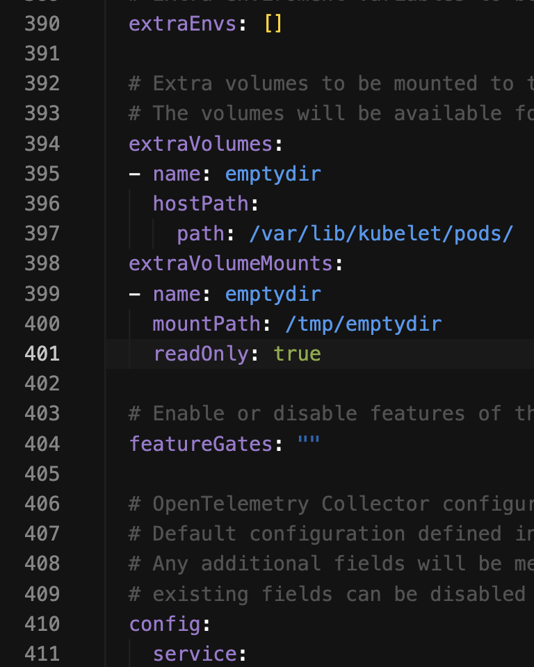
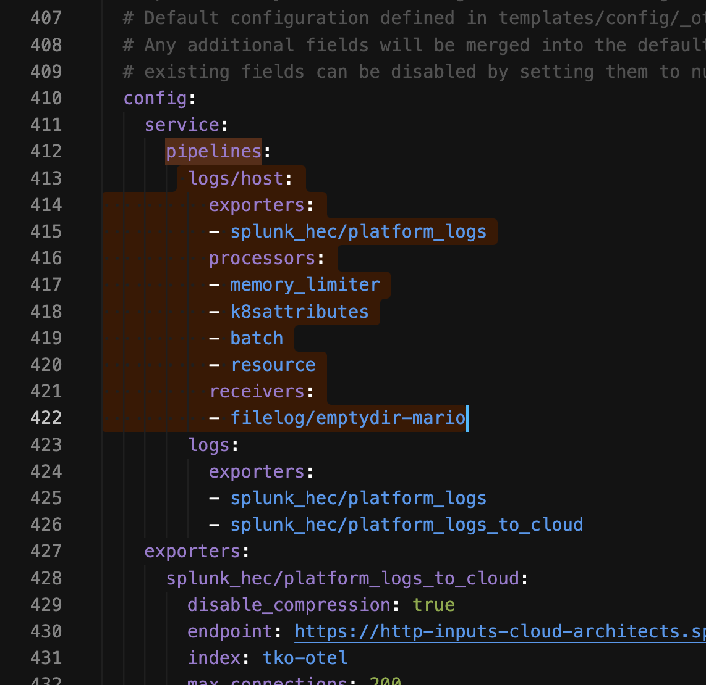

# Guide courtesy: Learning from Matthew Modestino TKO guide.

The values.yaml here can send to two separate Splunk Enterprise endpoints. Good for referencing if necessary.

# Important Setup (only if have access to the VM cmd)
- `cd /var/log`
- `sudo su`
- `mkdir mario`

# Use HostPath
- `kubectl create ns mario`
- Create a file with the content in mmodestino-mario-deploy.yaml
- `kubectl -n mario apply -f mmodestino-mario-deploy.yaml`
- If done correctly, you will see the following logs in `/var/log/mario` of the VM. 
- `kubectl create ns otel`
- Install Splunk OTel Collector Chart helm to pick up these logs with  in the values.yaml `helm install -n otel splunk-otel-col -f values.yaml splunk-otel-collector-chart/splunk-otel-collector`
- Verify the logs are in Splunk with `index="otel_events" sourcetype IN (tomcat:access:log, tomcat:runtime:log)`

# Use EmptyDir
- `vim mmodestino-mario-deploy-emptydir.yaml` 
- This mounts a special location on the node reserved for ephemeral storage. You can find this location on the node by navigating to /var/lib/kubelet/pods on the node as root. In this folder you will see each Pod’s uid. 
- You can find your pod’s uid in the metadata of your pod: `kubectl -n mario get pods mmodestino-mario-<something something something> -o yaml`
- In order to monitor this directory with the OTel collector, we will need to use the extraVolumes and extraVolumeMounts settings in the Helm chart to wire up this path into our agent daemonset. 
- This will mount the known emptyDir path from the node to our OTel agent so we can find it under /tmp/emptydir inside our pod filesystem, allowing us to create new filelog receiver inputs using the extraFileLogs section in our helm chart.  Here we have used the regex_parser to extract the fields called uid and volume_name. We then use the move operator to set them as resources called k8s.pod.uid and k8s.volume.name. 
- `helm -n otel upgrade splunk-otel-col -f values.yaml splunk-otel-collector-chart/splunk-otel-collector`

## Further enrich
- Now let’s attempt to further customize our pipeline to use the k8s.pod.uid to enrich the event further with the k8sattributes processor. To accomplish this we will need to override the default logs/host pipeline to route our emptyDir sourced logs through the existing k8sattributes processor. 
- `helm -n otel upgrade splunk-otel-col -f values.yaml splunk-otel-collector-chart/splunk-otel-collector`

Other ref:
- https://github.com/signalfx/splunk-otel-collector-chart/blob/main/docs/advanced-configuration.md#add-log-files-from-kubernetes-host-machinesvolumes