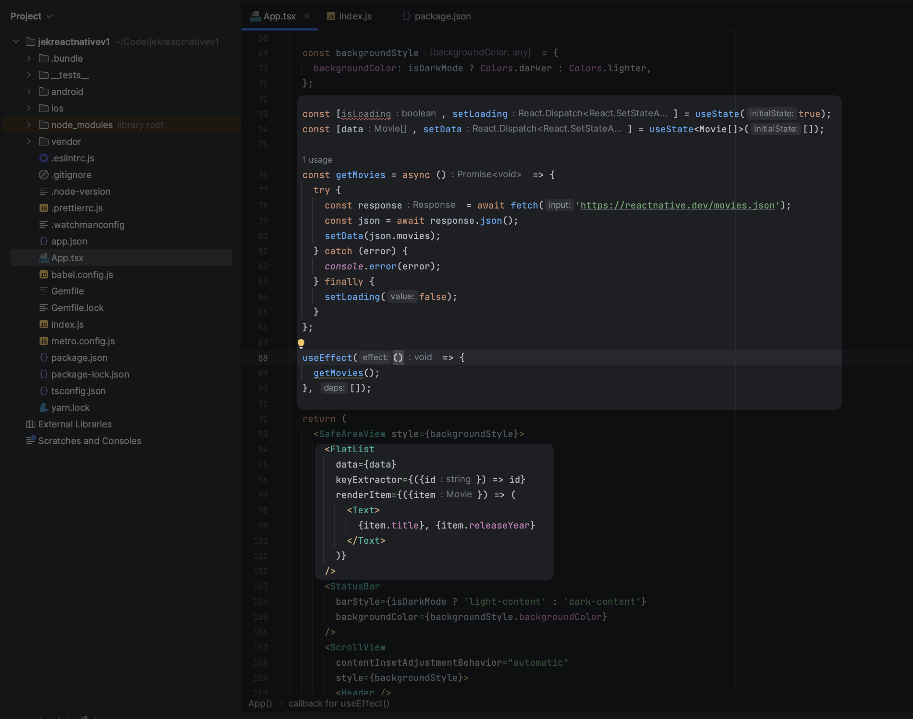
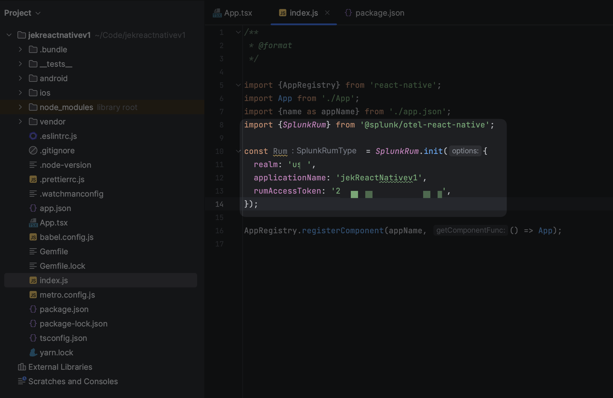

- Start with https://reactnative.dev/docs/environment-setup.
    - Select  these options based on my workstation setup. React Native CLI >> macOS >> iOS.
    - Follow through the docs environment setup.
    - Build a simple app following the setup doc.
    - After completion, open `App.tsx` in my text editor of choice and edit some lines.
- Edit the App.tsx to include code snippets from https://reactnative.dev/docs/network
    -  remember to add only the flatlist because VirtualizedList could cause some problem https://stackoverflow.com/a/58477746
    - Run the new addition with `npx react-native start` in terminal 1 and `npx react-native run-ios` in new terminal 2.
- Add splunk-otel-react-native https://github.com/signalfx/splunk-otel-react-native
    - Install via npm / yarn e.g. `npm install @splunk/otel-react-native`
    - Initialize the library  in index.js like 
```javascript
    import {SplunkRum} from '@splunk/otel-react-native';

const Rum = SplunkRum.init({
  realm: 'usN',
  applicationName: 'jekReactNativev1',
  rumAccessToken: 'XXXXXXXXXXXXXXXXX',
});
```

- After that go to the ios folder in a new terminal 3 do `bundle install` and `pod install`.

- Reboot the app with `npx react-native start` in terminal 1 and `npx react-native run-ios` in new terminal 2.

- Go to Splunk Observability Cloud to verify that the RUM has metrics and session info. 
