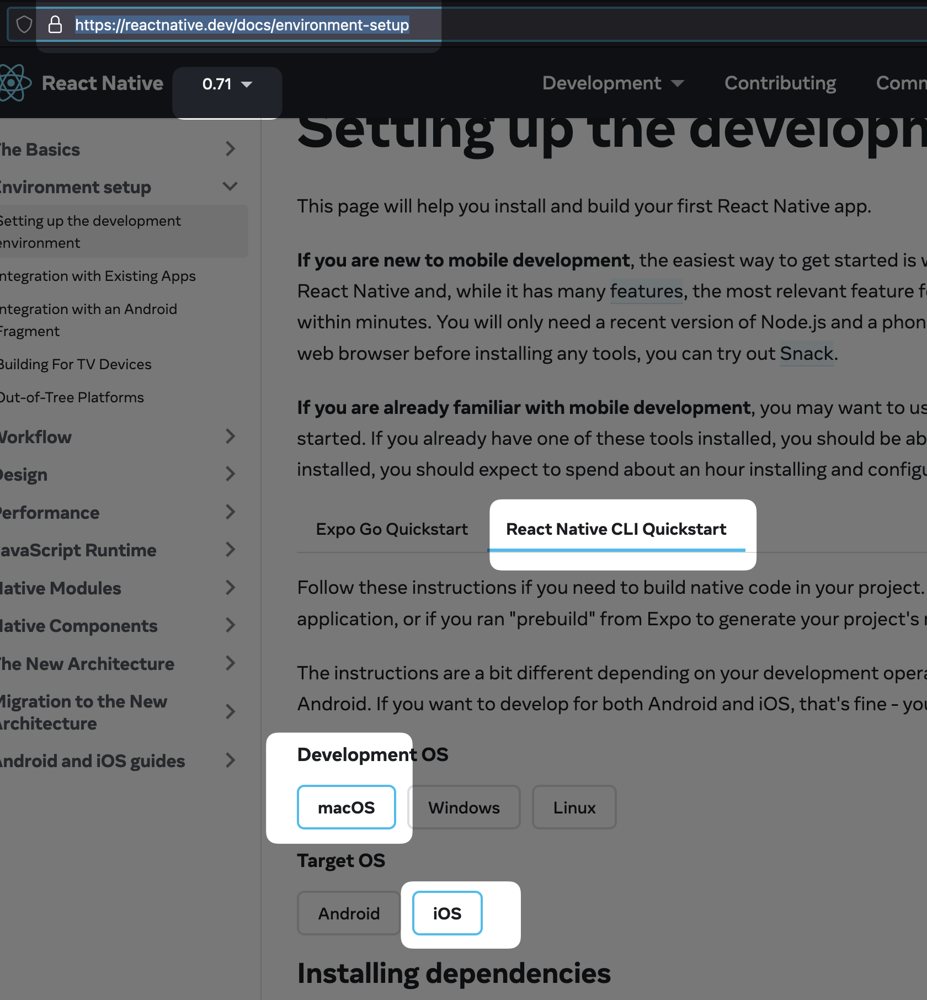
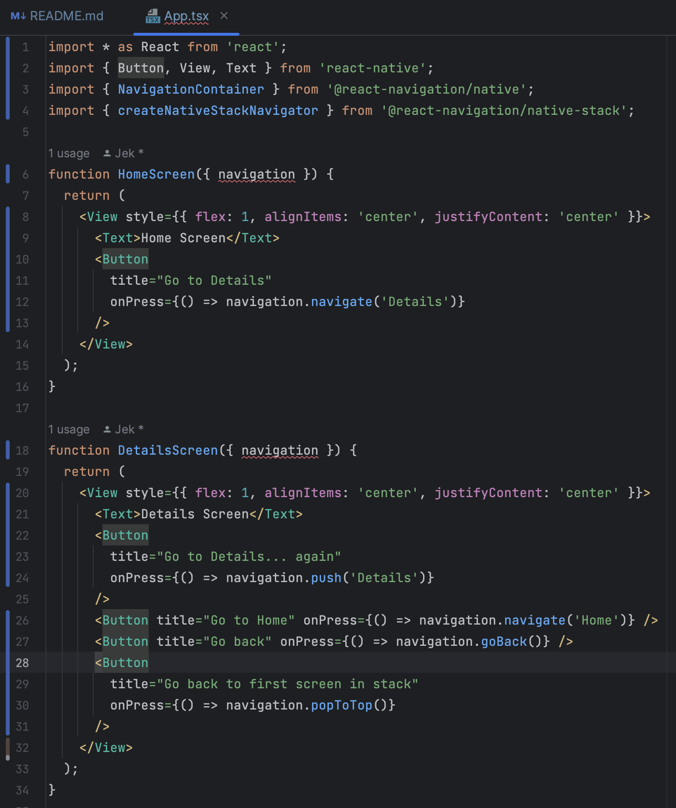
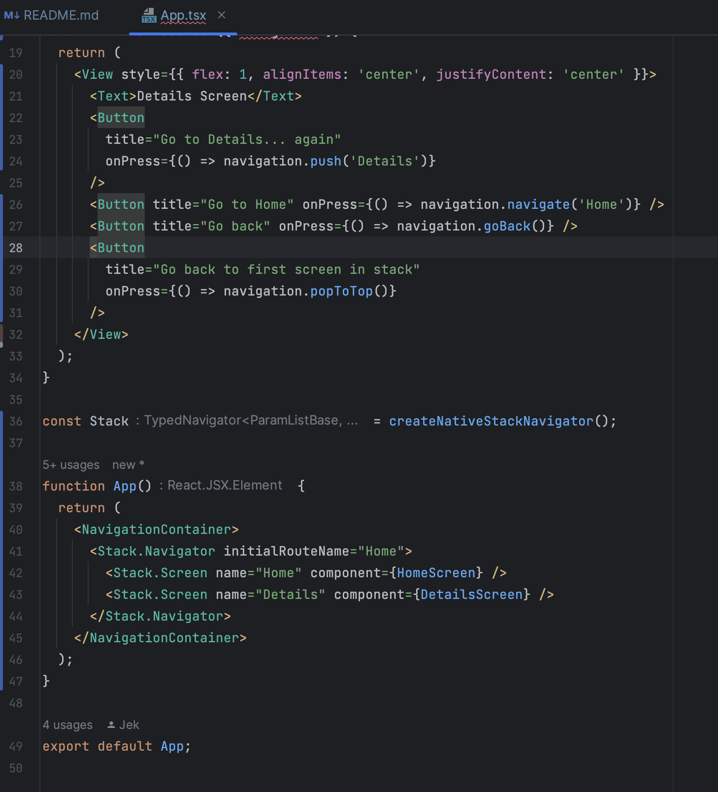
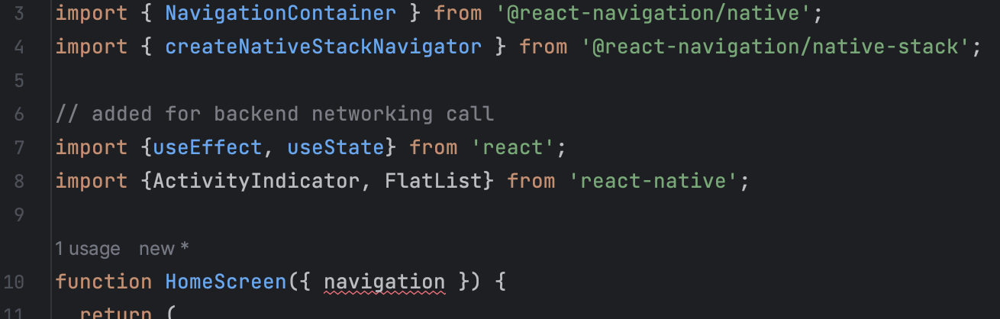
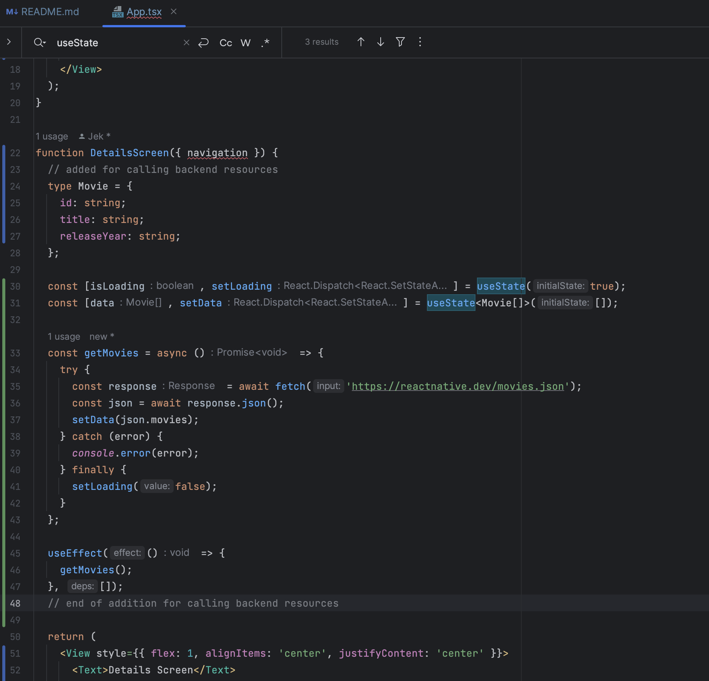
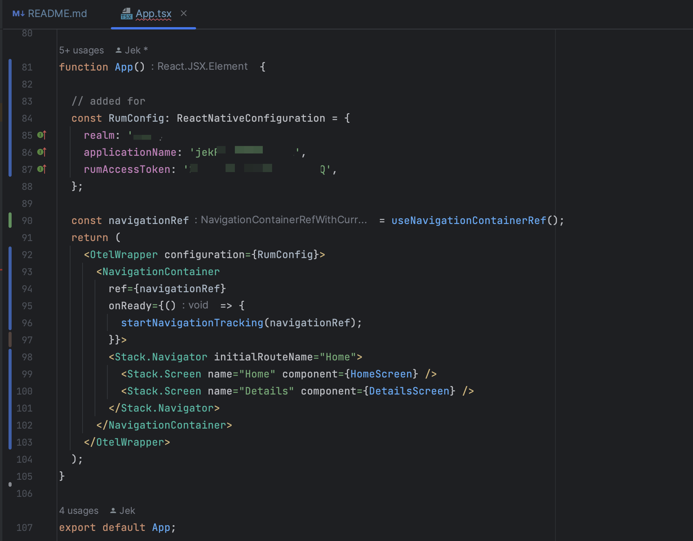
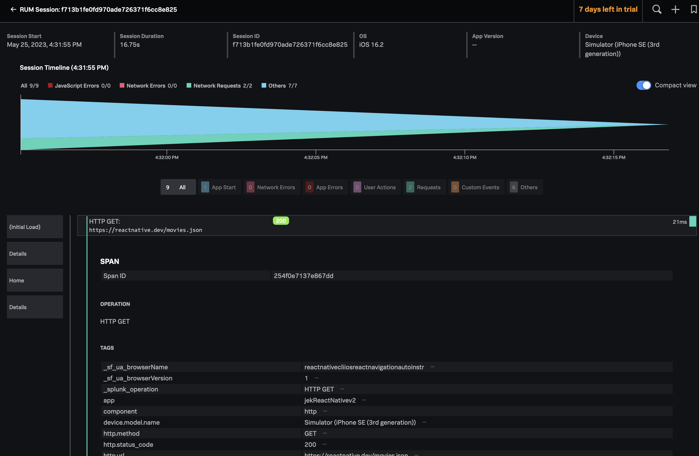
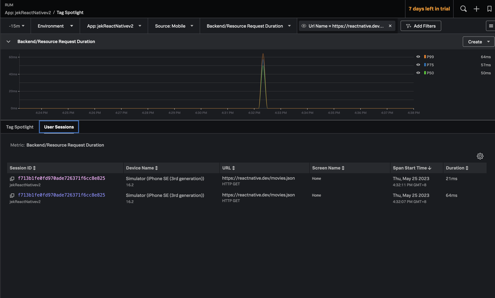

# Note
- This is for React Native using React Navigation https://reactnavigation.org/. If you are using React Native CLI basic (without using React Navigation) then this guide won't work for you. You need to refer to the folder that is `rum-js/reactnative-cli-ios-basic-auto-instr`.
- The project and code in this folder are created using the steps below. 

# Env
- Tested on React is version 18.2.0
- with React Native is version 0.71.8.
- With React Navigation version 6.1.6
- Using @splunk/otel-react-native version ^0.1.0-alpha.3. It also works with React Native 0.64.3 as tested but with newer version of @splunk/otel-react-native version would break with React Native 0.64.3 because at the time of testing the mini is: we "officially" support 0.67

# Get started
- Start with https://reactnative.dev/docs/environment-setup.
    - Select  these options based on my workstation setup e.g. React Native CLI >> macOS >> iOS.
    - Follow through the docs environment setup.
    - Build a simple app following the setup doc.
    - After completion, open `App.tsx` in my text editor of choice and edit some lines.
- Edit the App.tsx to include code snippets from these 3 docs in sequential order.
    - Comment or remove the default created code in App.tsx.
    - Then add code from
        - https://reactnavigation.org/docs/getting-started
        - https://reactnavigation.org/docs/hello-react-navigation
        - https://reactnavigation.org/docs/navigating
        - After addition it would look like this   
        - Run the new addition with `npx react-native start` in terminal 1 and `npx react-native run-ios` in new terminal 2.
- Edit the App.tsx to include code snippets from https://reactnative.dev/docs/network
    - It would look like this    
    - - Run the new addition with `npx react-native start` in terminal 1 and `npx react-native run-ios` in new terminal 2.
- Add splunk-otel-react-native https://github.com/signalfx/splunk-otel-react-native
    - Install via npm / yarn e.g. `npm install @splunk/otel-react-native`
    - Initialize the library  in App.tsx (unlike a basic version without using React Navigation) like 

In App.tsx
```typescript
//...

// added for splunk-otel-react-native
import { OtelWrapper, ReactNativeConfiguration, startNavigationTracking } from '@splunk/otel-react-native';

//...

function App() {
  // added for
  const RumConfig: ReactNativeConfiguration = {
    realm: 'usN',
    applicationName: 'jekReactNativev2',
    rumAccessToken: 'XXXXXXXXXXXXXX',
  };
  const navigationRef = useNavigationContainerRef();
  return (
    <OtelWrapper configuration={RumConfig}>
    <NavigationContainer
      ref={navigationRef}
  onReady={() => {
    startNavigationTracking(navigationRef);
  }}>
  <Stack.Navigator initialRouteName="Home">
  <Stack.Screen name="Home" component={HomeScreen} />
  <Stack.Screen name="Details" component={DetailsScreen} />
  </Stack.Navigator>
  </NavigationContainer>
  </OtelWrapper>
);
}

export default App;

```

- After that go to the ios folder `cd ios` in a new terminal 3 do `bundle install` and CocoaPods installed `pod install` then return to root folder `cd ..`.

- Reboot the app with `npx react-native start` in terminal 1 and `npx react-native run-ios` in new terminal 2.

- Go to Splunk Observability Cloud to verify that the RUM has metrics and session info. 

# Proof
  
